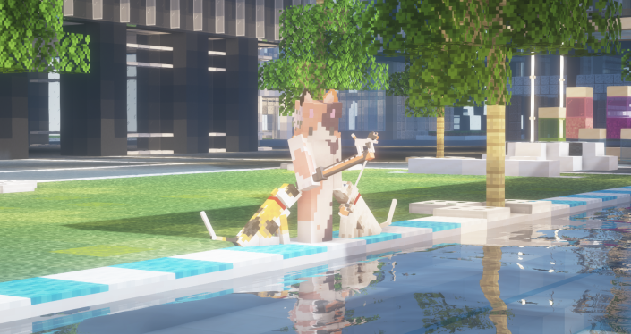
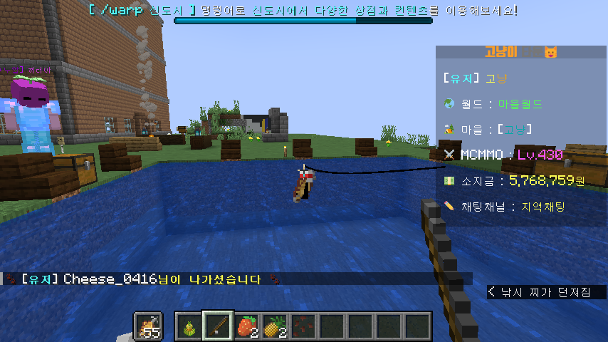
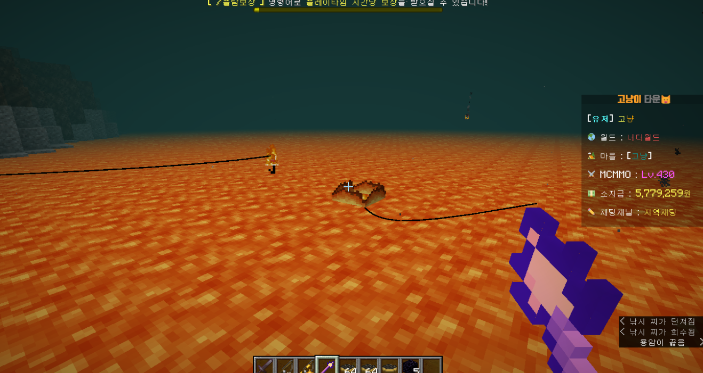
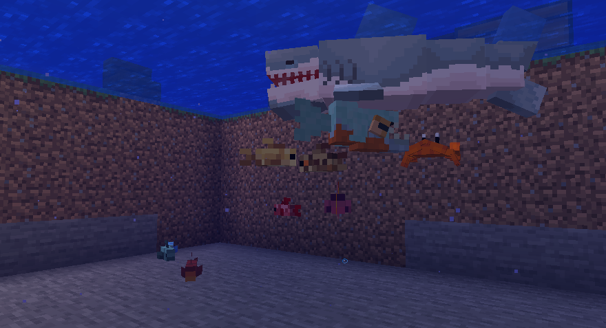
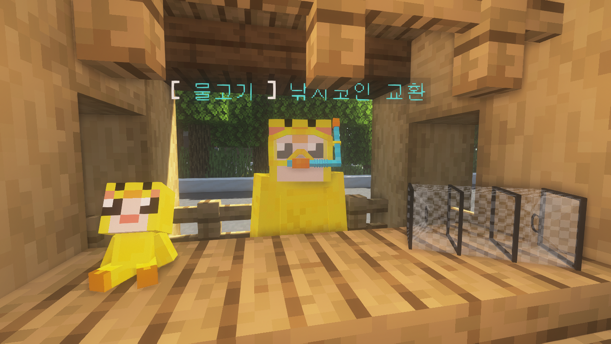

# 🎣 낚시


**낚시 시, 루나 클라이언트를 사용하지 마세요**

* 모든 엔티티가 화면에서 클라이언트에서사라지는 오류가 있으며, 이는 클라이언트 자체의 오류입니다.


<figure><figcaption>
고냥이타운 신도시 수영장
</figcaption></figure>

<figure><figcaption>
새로운 낚시 이펙트
</figcaption></figure>

<figure><figcaption>
고냥이 타운만의 커스텀 낚시바
</figcaption></figure>

> 🐳 고냥이타운 낚시 시스템&#x20;

* 고냥이타운의 낚시 시템은 물고기를 낚을 때 낚시 에 맞춰 정확하게 해당 부분에 우 클릭하여 낚시에 성공할 수 있습니다.
* 바닐라, MCMMO, 커스텀 물고기 모두가 등장하며, 커스텀 물고기 및 보물을 낚을 시에 경험치를 획득할 수 있습니다.&#x20;
* 바이옴 및 날씨에 따라 다양한 커스텀 물고기를 낚을 수 있습니다.
* 매일 오후 6시와 10시에 낚시대회가 열립니다.&#x20;

> 커스텀 낚싯대

<figure><figcaption>
은, 금 낚싯대 
</figcaption></figure>

<figure><figcaption>
물고기 미끼, 나뭇잎, 별 낚싯대 
</figcaption></figure>

서버 내에는 5가지 커스텀 낚싯대 (은, 금, 나뭇잎, 고양이, 별)을 획득할 수 있습니다&#x20;

* 기본 낚싯대 : 마인크래프트 기본 낚싯대이며, 낚시 시스템이 적용됩니다.
* 은, 금 낚싯대 : 서버 상점에서 판매하며, 각각 물고기를 5%, 10% 빠르게 낚을 수 있는 대신, 난이도가 증가합니다.
* 나뭇잎 낚싯대: 낚시코인으로 획득할 수 있으며, 물고기를 10% 빠르게 낚을 수 있습니다.
* 고양이 낚싯대: 추천코인으로 획득할 수 있으며, 난이도가 1 하락하고 물고기를 5% 빠르게 낚을 수 있습니다.
* 별 낚싯대:  낚시코인으로 획득할 수 있으며, 용암에서 낚시가 가능하고 물고기를 10% 빠르게 낚을 수 있습니다.

> 미끼&#x20;

<figure><figcaption></figcaption></figure>

미끼는 물고기를 낚을 확률을 증가시키며, 낚시가방 또는 왼손에 미끼를 들어 사용할 수 있습니다. 소모 시 미끼가 물려진 채로 던져집니다.

* 일반 미끼 - 상점에서 판매하며, 물고기를 15% 빠르게 낚을 수 있지만, 난이도가 1 증가합니다.
* 물고기 미끼 - 낚시코인으로 획득할 수 있으며, 물고기를 30% 빠르게 낚을 수 있습니다.&#x20;

> 낚시 가방&#x20;

<figure><figcaption></figcaption></figure>

* 낚시가방에는 미끼와 낚싯대를 보관할 수 있으며, 낚시가방에 미끼 보관 시 낚시 시 자동으로 미끼가 사용됩니다.&#x20;
* /낚시가방 명령어로 가방에 진입합니다.

> 낚시상점&#x20;

<figure><figcaption></figcaption></figure>

* 낚시상점 시스템은 `/낚시상점 /물고기` 명령어로 사용할 수 있으며, 물고기 판매상 안에 판매할 물고기를 넣고 버튼을 클릭하면 판매됩니다

> 지옥  낚시

<figure><figcaption></figcaption></figure>

<figure><figcaption></figcaption></figure>

* 별 낚싯대를 이용하면 지옥에서 낚시를 할 수 있습니다.
* 지옥에 맞는 다양한 아이템(흑요석, 시계, 철 조각, 금 조각, 시계, 신비한 물고기 + MCMMO 보물) 등이 드롭됩니다.&#x20;

> 커스텀 몹 물고기  (추가예정)&#x20;

<figure><figcaption></figcaption></figure>

* 낚시로 서버 내 존재하는 다양한 커스텀 몹(물고기) 를 낚을 수 있습니다.

> 낚시코인, 낚시코인 상점

<figure><figcaption></figcaption></figure>

서버 내에서 낚시를 통해 낚시코인을 낮은 확률로 획득할 수 있으며, 획득한 낚시코인은 유저간 거래, 판매 및 스폰 상점에서 보물로 교환할 수 있습니다.

* 곧 추가되는 다양한 보물들을 낚시코인 상점에서 만나보세요!
