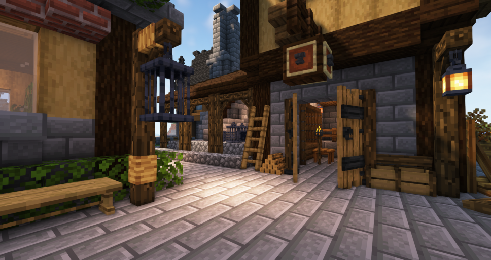
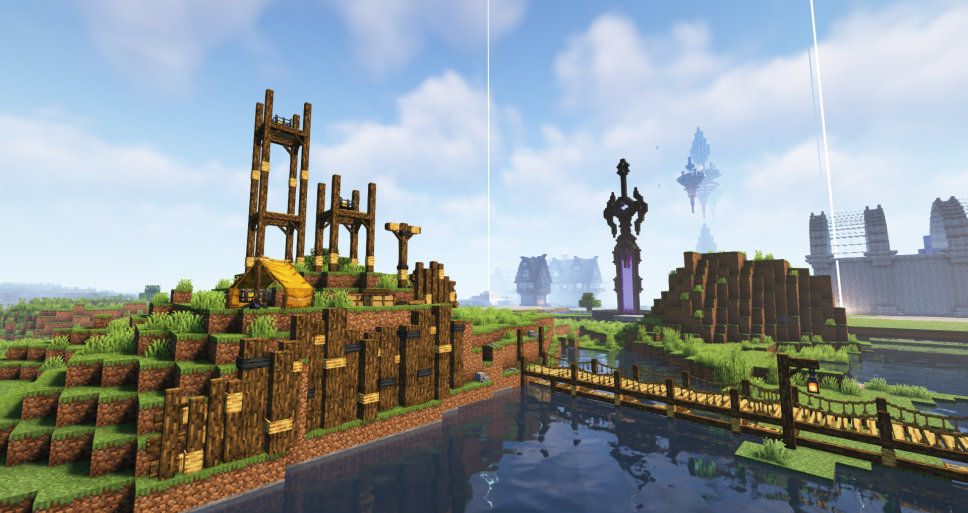

# 🪑 가구


**청크당 가구 수 제한 안내**

청크당 최대 64개의 가구를 배치할 수 있습니다.

* 엔티티란 갑옷거치대, 아이템액자, 투명액자, 몹을 전부  포함하며, **청크 내 엔티티 총량이 64개가 넘어갈 경우, 가구 설치가 불가능**합니다.


<figure><figcaption>
고냥이타운 신도시 가구상점 (회색 가구)
</figcaption></figure>

<figure><figcaption>
고냥이타운 도시월드 스폰 상점가 옆 (조경 가구)
</figcaption></figure>

<figure><figcaption>
가구상점 최상층, 모던 가구
</figcaption></figure>

* 고냥이 타운에서는 다양한 종류(200가지 이상)의 가구들이 있으며,  다양한 경로를 통해 가구 아이템을 획득하고 인테리어를 할 수 있습니다.
* 일부 가구 상호작용을 지원합니다. (앉기, 쓰레기통, 조합 등)
* **/warp 가구상점 명령어로 가구 체험이 가능합니다!**\


**각각의 가구 획득 경로 안내**

* **빨강, 하양, 청록, 회색, 조경, 상점 가구 -> 필드조합으로 획득 가능 (/ia 명령어 사용)**
* **조경가구 2 -> 작물 교환권으로 획득 가능**
* **모던, 자수정  -> 서버 돈으로 획득 가능**&#x20;
* **철 -> 추천코인으로 획득 가능**


<figure><figcaption>
필드 조합으로 획득(빨강, 하양, 청록, 회색, 조경)
</figcaption></figure>

<figure><figcaption>
추천코인으로 획득 (철)
</figcaption></figure>

<figure><figcaption>
작물 교환권으로 흭득 (정2)
</figcaption></figure>

<figure><figcaption>
서버 돈으로 획득 (자수정)
</figcaption></figure>

<figure><figcaption>
서버 돈으로 획득 (모던)
</figcaption></figure>

<figure><figcaption>
필드 조합으로 획득 (상점) 
</figcaption></figure>

## <수정예정>

## 🎁  가구 랜덤박스 (중국 춘절 가구 뽑기권) 추가


**랜덤박스는 모두 확률이 동일합니다.**


<figure><figcaption>
춘절 가구 뽑기권으로 뽑을 μ 있는 춘절 테마 가구
</figcaption></figure>

중국 춘절 가구를 얻을 수 있는 뽑기권이 추가되었습니다. \
뽑기권을 들고 도시월드 왼쪽 뽑기존에서 등불에 우클릭하면 뽑기를 진행할 수 있습니다.

|                                             | 이름           | 획득 경로                | 설명                    |
| ------------------------------------------- | ------------ | -------------------- | --------------------- |
| .png>) | 중국 춘절 가구 뽑기권 | **추천코인, 소지금(/shop)** | 우클릭 시, 확률적으로 춘절 가구 획득 |

가구를 통해 얻을 수 있는 품목과 아이템은 다음과 같습니다.

[랜덤박스 등장 아이템 ] 

.png>)

* 계단형 3단 복자등&#x20;
* 중간 3단 복자등&#x20;
* 끈 달린 복자등&#x20;
* 끈 달린 이중 복자등&#x20;
* 끈 달린 삼중 복자등&#x20;
* 복자 소형 등불&#x20;
* 복자 대형 등불&#x20;
* 복자 대형 가로등&#x20;
* 음양 벽걸이&#x20;
* 복자 소형 가로등&#x20;
* 빨간 우산&#x20;
* **하늘색 우산 (페인트 가능)**&#x20;
* 새해 폭죽 수레&#x20;
* 끈 달린 복자 장식&#x20;
* 벚꽃나무 잎&#x20;
* 단풍나무 잎&#x20;
* 새해 폭죽&#x20;
* 엎어진 새해 폭죽&#x20;
* 벚꽃 의자&#x20;
* 꽃이 핀 벚꽃나무 묘목&#x20;
* 열매가 맺힌 벚꽃나무 묘목&#x20;
* 벚꽃 테이블&#x20;
* 등불 돌 장식

## 🪑  오늘의 가구상점

<figure><figcaption>
ㅁ도시월드 스폰 앞에 위치한 가구상점
</figcaption></figure>

**139종의 신규 가구**가 등장하는 가구상점이 새롭게 추가되었습니다. 가구는 **매일 오전 8시에** 랜덤으로 **판매 품목이 변경**되며, 일부 **대형 조형물과 페인트 가능한 가구**가 등장합니다. &#x20;

[ 가구상점 등장 아이템 ] 

* **(가격/설명은 추후 위키 정리 예정)**&#x20;

.png>)

.png>)

.png>)

.png>)

### 가구상점 등장 테마

**중세, 나무, 소풍 3개의 테마 가구가 등장합니다.**

<figure><figcaption>
중세 테마 가구
</figcaption></figure>

<figure><figcaption>
중세 테마 가구 2
</figcaption></figure>

<figure><figcaption>
나무 테마 가구
</figcaption></figure>

<figure><figcaption>
소풍 테마 가구
</figcaption></figure>

## 🎨  가구 페인트

<figure><figcaption>
페인트로 색칠한 가구
</figcaption></figure>

<figure><figcaption>
페인트 제작대 사용법
</figcaption></figure>

가구에 색깔을 칠할 수 있는 가구 페인트 시스템이 업데이트 되었습니다.  \
페인트를 하기 위해서는 **페인트 제작대**가 필요하며, 추천코인 6개 또는 **/shop**에서 소지금 75000원에 구매할 수 있습니다. 페인트가 가능한 가구아이템은 설명에 ** **<mark style="color:blue;">**\[🖌️PAINT]**</mark> 가 붙어 있습니다.

|                                       | 이름       | 획득 경로                |                                                                                                 |
| ------------------------------------- | -------- | -------------------- | ----------------------------------------------------------------------------------------------- |
|  |  페인트 제작대 | **추천코인, 소지금(/shop)** | 
우클릭시, 페인트 GUI 오픈  <mark style="color:blue;"><strong>[🖌️PAINT]</strong></mark> 아이템 전용
 |

획득 가능한 페인트 아이템은 다음과 같습니다.&#x20;

* **발렌타인 가구 랜덤박스 - 장미가 든 꽃병**&#x20;
* **중국 춘절 가구 랜덤박스 - 우산**
* **가구상점 - 목재 소파 등 24종**&#x20;
