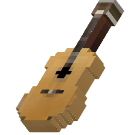

# 🎷 악기

## 악기

악기는 음악을 연주할 수 있는 도구로, 고냥이타운의 예술 컨텐츠입니다. 신도시 중앙상가 3층 악기상점에서 악기를 구매하여 연주할 수 있으며, 일반악기와 합주악기 두 가지로 나뉘어져 있습니다. 악기상점에는 악기 음계를 들어볼 수 있는 체험존이 마련되어 있어, 좌클릭으로 눌러 보면서 음을 들어볼 수 있습니다.

## 일반악기

<figure><figcaption>
일반악기 연주 GUI
</figcaption></figure>

일반악기는 간편한 연주가 가능한 악기로, 악기상점에 위치한 액자상점에서 **소지금 10만원**을 주고 구매할 수 있습니다. 우클릭하면 악기를 연주할 수 있는 GUI를 오픈하며, 건반을 클릭하여 노트블럭 영역(낮은 파#\~높은 파)의 소리를 연주할 수 있습니다. 연주 시에는 파티클이 반짝입니다.

### 스케일 (음계)

연주 GUI 오른쪽 상단에 위치한종이 모양 아이콘을 눌러 음계 연주를 할 수 있으며, 숫자 키를 이용하여 연주가 가능합니다.

### 화음

화음은 여러 음을 동시에 낼 수 있는 악기 기술로, 해당하는 건반을 쉬프트 클릭하여 연주합니다. 예시로, '도'음을 쉬프트 좌클릭할 경우, 다장조 화음을 연주합니다. 해당 기술을 응용하면 할아버지의 시계와 같은 곡을 연주할 때 화음을 적절히 섞어 연주할 수 있습니다.&#x20;

* 웅크리기(Shift)와 건반을 동시에 좌클릭하여 메이저(장조) 화음을 연주할 수 있습니다.&#x20;
* 웅크리기(Shift)와 건반을 동시에 우클릭하여 마이너(단조) 화음을 연주할 수 있습니다.&#x20;

### 종류

일반악기는 16종의 악기가 있습니다.&#x20;

|                                       | 이름  |                                        | 이름    |                                    | 이름   |                                      | 이름     |
| ------------------------------------- | --- | -------------------------------------- | ----- | ---------------------------------- | ---- | ------------------------------------ | ------ |
|      | 피아노 |       | 플루트   |  | 기타   |      | 베이스 기타 |
|  | 실로폰 |  | 철 실로폰 |   | 작은 북 |  | 베이스 드럼 |
|       | 비트  |       | 플링    |   | 벤조   |        | 디저리두   |
|       | 벨   |     | 카우벨   |  | 차임   |    | 막대기    |

## 합주악기 (By.Blank In)


합주악기를 활용한 악보연주 동영상


합주악기는 일반악기와는 다르게 악보기능이 추가된 새로운 악기이며, 마우스의 높낮이를 이용하여 우클릭으로 연주하는 악기입니다. 악기상점에서 NPC를 클릭하여 추천코인을 주고 구매가 가능합니다.

### 특징

* **우클릭하여 마우스의 높낮이에 따라 연주하며, 쉬프트 (SHIFT)를 누른 상태에서 연주하면** **반음(#)을 연주합니다.**
* **주요손과 보조손에 각각 다른 악기를 올려 마우스 좌클릭과 우클릭으로 양손 연주가 가능합니다.**

### 종류

**피아노, 드럼, 기타, 일렉 기타, 종, 비트, 바이올린의 7가지 악기가 있습니다.**

|                                          |                                        |                                             |
| ---------------------------------------- | -------------------------------------- | ------------------------------------------- |
| .png>)  |        |         |
| .png>) |  | .png>) |
|        |                                        |                                             |

### 악보

<figure><figcaption>
책상점에서 구매 가능한 악보ㄱ
</figcaption></figure>

악보는 악보책을 이용하여 연주하는 방법으로, 챗과 깃펜을 이용하여 악보 양식대로 악보를 적을 시, 악기를 이용하여 연주가 가능합니다. 악보는 한 책당 최대 50쪽까지 작성이 가능하며, **/책상점**을 이용하거나 **디스코드 악보 공유 게시판을** 이용하면 다른사람이 만든 악보를 쉽게 구매하고 제작할 수 있습니다.

1. **/악보등록** : **손에 든 악보를 연주할 악보로 등록할 수 있습니다.**
2. **/악보연주** : **해당 악보를 연주할 수 있습니다.**
3. **/악보연결** : 손에 든 악보를 첫번째 연주가 끝난 직후, 두 번째 악보로 등록하여 연결합니다.
4. **/지휘자등록 \[닉네임] :** 등록한 사람이 악보연주 명령어를 사용하였을 경우 자신도 연주를 시작합니다.

### 악보 작성하기

고냥이타운의 악보는 책과 깃펜에 **\[음계] \[박자] \[음계] \[박자] ..**. 형식으로 숫자를 적어 작성하며, 다음과 같은 규칙이 있습니다.

1. 악보 작성은 크게 **음계와 박자**로 이루어지며, 음 뒤에 무조건적으로 박자가 들어가야 합니다.
2. 악보에는 오직 숫자, 띄어쓰기, 줄바꿈, b, #, -, +,C ,F, L만 작성할 수 있으며, 만약 다른 문자를 입력할 시 연주 중에 오류를 띄우며 연주가 중단됩니다.&#x20;
3. 다음 숫자로 넘어갈 때 띄어쓰기 혹은 줄바꿈을 1회만 해야 하며, 2회 이상 할 시 오류가 발생합니다.

<figure><figcaption>
악보의 계이름, 표시할 수 있는 음계는 0~14입니다.
</figcaption></figure>

반짝반짝 작은별의 악보를 예시로 들어 설명해보겠습니다.

<figure><figcaption>
반짝반짝 작은별 예제 악보
</figcaption></figure>

* 해당 악보에서 왼쪽은 음계, 오른쪽은 박자입니다.\
  **음계**는 **피아노의 계이름**을 말하며, 0\~14까지 있고, 악기를 들고 연주하면 나오는 계이름과 똑같습니다. \
  ( 4 - 도 | 5 - 레 | 6 - 미 )
* **박자**란 **한음이 연주되고 다음 음이 연주되기까지 기다리는 시간**을 말하며, 박자에서 1은 1초가 아닌 1틱을 의미합니다. (약 0.2초)&#x20;
* **해당 악보를 글로 표현하면 도(1.6초) / 도(1.6초)/ 솔(1.6초) / 솔(1.6초) / 라(1.6초)/ 라(1.6초) / 솔(3.2초) / 파(1.6초)/ 파(1.6초) /미(1.6초)/미(1.6초)/레(1.6초) /레 (1.6초)/도(1.6초) 입니다.**&#x20;
* 가장 간단하게 이해할수 있는 방법은, **노래를 들어보고 직접 박자를 찍어보며 적절한 박자를 찾는 것** 입니다.

**중급 테크닉 (⭐)**

* 음계에 **4#**과같이 #을 추가로 적으면 **반올림 음**을 연주하게 됩니다. 반올림이 없는 음은 기존의 음을 연주합니다.
* 음계에 **4b**과같이 b을 추가로 적으면 **반내림 음**을 연주하게 됩니다. 반내림이 없는 음은 기존의 음을 연주합니다. (추가 10.20)
* 음계에 "**-**" 를 적을 경우, 쉼표로 사용할 수 있으며, 입력 시 아무음도 연주하지 않고 그 후에 적은 길이만큼 시간이 지난 후 다음 음으로 넘어갑니다.&#x20;
* 음을 입력한 후에 **+**를 입력할 시, 추가적으로 다른 음을 적을 수 있으며, 만약 **0+5+7#**를 입력한다면 **연주를 할때 세 음을 동시에 연주**합니다. 이 기능을 활용해 **5+5+5**를 입력한다면 **연주의 크기**를 키울 수 있습니다.

**심화 테크닉 (⭐⭐)**

**음계에 F를 입력할 시, 해당 음을 연주할 때 양손의 아이템을 바꿉니다.**

* **4 2 5F**(F5의 형태도 가능) **2** 를 악보에 적으면 도를 연주한 후 양손의 아이템을 바꾸어 레를 연주합니다. (바꾼 후 연주할 음을 앞이나 뒤에 넣어주지 않으면 0(파♯)으로 연주)

**음계에 C숫자(1\~9)를 입력시 해당 음을 연주할때 숫자에 해당하는 슬롯으로 이동합니다.**

* **4 2 5C2**(C25의 형태도 가능) **2** 를 악보에 적으면 도를 연주한 후 2번 슬롯으로 이동해 레를 연주합니다. (이동한 후 연주할 음을 앞이나 뒤에 넣어주지 않으면 0(파♯) 으로 연주)

**음계에 L숫자를 입력할 시 숫자에 해당하는 슬롯에 악보가 존재할 시 현재 악보를 중단하고 해당 악보로 넘어가게 되고 만약 존재하지 않는다면 현재 악보를 계속해서 연주합니다.**

* 악보가 존재하여 넘어가게 될 시 해당 음절의 내용은 연주하지 않으며, 4+5+L1 로 악보를 넘어가게 되면 4(도)와 5(레)는 무시됩니다.

## **옥타브 악기**

옥타브 악기는 악기상점에서 옥타브 패키지로 판매하는 악기를 말하며, 합주악기와 동일하나, **F(줄바꾸기)**를 이용하여 연주하는 악기이며, 다양한 옥타브를 추가함으로써 악보로 표현할 수 있는 음계의 범위를 대폭 늘린 악기입니다. 최대 5개의 옥타브를 오갈 수 있습니다.&#x20;

옥타브 악기는 악기상점의 별도 교환소에서 구매할 수 있으며, 옥티브 패키지를 구매하여 5개의 묶음 악기(-2,-1,0,1,2)를 획득할 수 있습니다. \
옥타브 악기를 이해하기에는 난이도가 있는 편이며, /책상점 또는 **디스코드 악보 공유 게시판**을 통해 팁을 얻는 것이 도움이 됩니다.

<figure><figcaption></figcaption></figure>

**옥타브 악기 테크닉 (⭐⭐⭐)**

혼자서 다양한 악기를 활용하고 싶어요 (옥타브 악기  활용) 

* 첫 악기의 연주음을 적고 연주시간을 0으로  적은 다음, C나 F로 악기를\
  변경 하여 연주 후 기존에 연주하려고 한 시간으로 적으시면 됩니다.

.png>)

* 악보 설명 : 1번 슬롯으로 이동하여 도 연주 후 텀 없이 2번 슬롯으로 이동하여 도 연주 후 8틱 대기후 1번 슬롯으로 이동하여 레 연주 후 텀 없이 2번 슬롯으로 이동하여 레 연주후 1번슬롯으로 이동하여 쉼(-1)후 종료 C14 는 C1+4 와 같습니다
* 악보 작성 노하우만 있다면 슬롯 9칸과 왼손까지 해서 10개 악기 동시 연주가 가능합니다.

## 변경사항

| 날짜             | 설명                                                                |
| -------------- | ----------------------------------------------------------------- |
| **2022.09.11** | 일반악기(16개) /악기상점 / 악기 청음존이 추가되었습니다.                                |
| 2022.09.12     | 
합주악기가 추가되었습니다. (By.Blank-In) - 피아노, 기타, 일렉기타, 종, 비트, 드럼
 |
| 2022.10.16     | 합주악기의 옥타브 피아노와 일렉기타, 바이올린이 추가되었습니다.                               |
