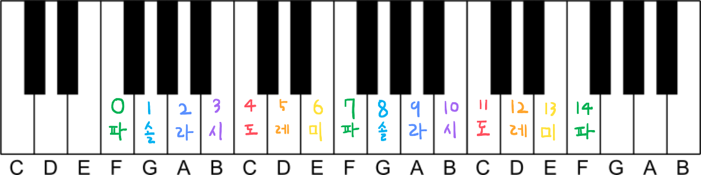

# 🎷 악기

<figure><figcaption>
고냥이 타운의 악기 컨텐츠
</figcaption></figure>

* 악기는 신도시 중앙상가 3층 악기상점에서 구매할 수 있습니다. ****&#x20;
* **일반악기와 합주악기, 두 종류의 악기가 존재합니다 (각각 수동, 자동악기로 분류됩니다)**

> 일반악기

<figure><figcaption>
일반악기 GUI
</figcaption></figure>

* 16종의 다양한 악기를 연주할 수 있으며, 낮은 솔\~ 높은 파 (노트블럭 영역)까지 연주할 수 있습니다.
* 웅크리기(Shift)와 건반을 동시에 눌러 화음을 연주할 수 있습니다. (쉬프트+좌클릭, 쉬프트+우클릭)
* 스케일 연주가 가능합니다.

> 합주악기  **by. Blank In**


**악보 제작 시 난이도가 있는 악기입니다.**

튜토리얼을 꼭 숙지해 주세요!


<figure><figcaption>
합주악기 밴드
</figcaption></figure>



기존 일반악기와의 차이점

* 악보기능, 합주기능의 추가 및 악기 컨트롤 방식이 변경되었습니다.  (손으로 연주 가능)

**1. 악기 설정과 연주**

* **손에 들고 우클릭 좌표로 연주하며, 웅크리기(Shift)를 누른 상태에서 연주하면 반음(#)을 연주합니다.**
* **주요손과 보조손에 각기 다른 악기를 마우스 좌클릭과 우클릭으로 따로 연주할 수 있습니다. (양손 연주 가능)**

**2. 악보기능**&#x20;

* **책과 깃펜에 악보 양식대로 악보를 적을 시 악기로 연주가 가능합니다.**&#x20;
* **/악보등록** 명령어로 손에 든 악보를 연주할 악보로 등록할 수 있습니다
* 악기를 오른손에 든 상태로 **/악보연주** 명령어를 사용하여  해당 악보를 연주할 수 있습니다.
* 50쪽까지 악보 등록이 가능하며, **/악보연결** 명령어를 사용하면 두 번째 악보로 넘길 수 있습니다.&#x20;

> &#x20;**🎼 악보 작성 튜토리얼**&#x20;

<figure><figcaption>
반짝반짝 작은별 예제 악보
</figcaption></figure>

> **🎼 고냥이타운의 악보는 책과 깃펜에 숫자를 적어 넣어 작성합니다.**

* 악보 작성 시 음 뒤에 무조건적으로 박자가 들어가있어야하며, 만약 양식이 올바르지 않을 시 악보 연주 중에 오류를 띄우며 연주가 중단됩니다.
* 악보에는 오직 숫자(0\~14), 띄어쓰기, 줄바꿈, b #, -, +,C ,F, L 만 작성할 수 있으며, 만약 다른 문자를 입력할 시 연주 중에 오류를 띄우며 연주가 중단됩니다.\

<figure><figcaption></figcaption></figure>

> **🎼 음은 0\~14까지 있으며 계이름은 악기를 들고 연주하면 나오는 계이름과 똑같습니다.**

* ( 4 - 도 | 5 - 레 | 6 - 미 )

> **🎼  박자란 ‘한 음이 연주되고 다음 음이 연주되기까지 기다리는 시간’이라고 이해하시면 편합니다.**

* 박자에서 1은 1초가 아닌 1틱을 의미하며 1틱은 약 0.2초입니다.
* 음을 적은 후 4#과같이 #을 추가로 적으면 반올림 음을 연주하게 됩니다. 반올림이 없는 음은 기존의 음을 연주합니다.
* **음을 적은 후 4b과같이 b을 추가로 적으면 반내림 음을 연주하게 됩니다. 반내림이 없는 음은 기존의 음을 연주합니다. (추가 10.20)**
* "-" 는 쉼표입니다. 입력 시 아무음도 연주하지 않고 그 후에 적은 길이만큼 시간이 지난 후 다음 음으로 넘어갑니다. - 는 음의 위치에 존재해야합니다
* 해당 부분을 가장 간단하게 이해할수 있는 방법은, **'노래를 들어보고 직접 박자를 찍어보며 적절한 박자를 찾는 것'** 입니다.

> **🎼  음을 입력한 후에 + 를 입력할시 추가적으로 다른 음을 적을 수 있습니다.**

* 만약 0+5+7#를 입력한다면 연주를 할때 세 음을 동시에 연주합니다.
* 이 기능을 활용해 만약 5+5+5를 입력한다면 연주의 크기를 키울 수 있습니다.

> **🎼** 다음 숫자로 넘어갈 때 띄어쓰기 혹은 줄바꿈을 2회 이상 할 시 오류가 납니다.

* 다음 숫자로 넘어갈 때는 반드시 띄어쓰기 혹은 줄바꿈을 1회만 입력해 주세요.

\------- < 심화 과정 > ------&#x20;

> **🎼 심화 -** 음에 **F**를 입력할 시 해당 음을 연주할때 양손의 아이템을 바꿉니다.

*   **4 2 5F**(F5의 형태도 가능) **2** 를 악보에 적으면 도를 연주한 후 양손의 아이템을 바꾸어 레를 연주합니다.

    (바꾼 후 연주할 음을 앞이나 뒤에 넣어주지 않으면 0(파♯)으로 연주)

> **🎼 심화 -** 음에 **C숫자**(1\~9)를 입력시 해당 음을 연주할때 숫자에 해당하는 슬롯으로 이동합니다.

**4 2 5C2**(C25의 형태도 가능) **2** 를 악보에 적으면 도를 연주한 후 2번 슬롯으로 이동해 레를 연주합니다.

(이동한 후 연주할 음을 앞이나 뒤에 넣어주지 않으면 0(파♯) 으로 연주)

> **🎼 심화 -** 음에 **L숫자**를 입력할 시 숫자에 해당하는 슬롯에 악보가 **존재할 시 현재 악보를 중단하고 해당 악보로** 넘어가게 되고 만약 **존재하지 않는다면 현재 악보**를 계속해서 연주합니다.

* (악보가 존재하여 넘어가게 될 시 해당 음절의 내용은 연주하지 않음 4+5+L1 에서 악보를 넘어가게 되면 4(도)와 5(레)는 무시됩니다.)

😺 **음과 박자를 이용해 자신만의 악보를 만들어보세요!  (이 부분을 읽고 잘 모르시겠다면, 질문게시판에 상세히 남겨주시길 바랍니다!)**&#x20;

**3. 합주기능 (/지휘자등록)**

* **지휘자를 등록할 시 등록한 사람이 악보연주 명령어를 사용하였을 경우 자신도 연주를 시작합니다.**

****

**4. 옥타브 피아노**

* 옥타브 피아노는 악보에서 F(줄바꾸기)를  이용하여 연주하는 악기이며, 다양한 옥타브를 추가함으로써 악보로 표현할 수 있는 음계의 범위가 넓습니다.
* 5 옥타브까지 지원됩니다. (옥타브 순서는 -2, -1, 기본, 1, 2 순입니다)\

> 악보 관련 q\&a

1. \[심화] 혼자서 다양한 악기를 활용하고 싶어요 (옥타브 피아노 및 다른 악기)&#x20;

* 첫 악기의 연주음을 적고 연주시간으로 0 적으시고 다음 음에서 C나 F로 악기 변경 하여 연주 후 기존에 연주하려고 한 시간으로 적으시면 됩니다.

<figure><figcaption></figcaption></figure>

* 악보 설명 : 1번 슬롯으로 이동하여 도 연주 후 텀 없이 2번 슬롯으로 이동하여 도 연주 후 8틱 대기후 1번 슬롯으로 이동하여 레 연주 후 텀 없이 2번 슬롯으로 이동하여 레 연주후 1번슬롯으로 이동하여 쉼(-1)후 종료 C14 는 C1+4 와 같습니다
* 악보 작성 노하우만 있다면 슬롯 9칸과 왼손까지 해서 10개 악기 동시 연주가 가능합니다.
