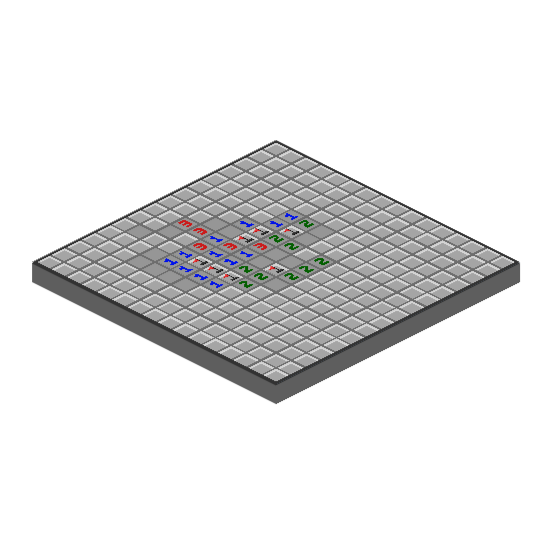
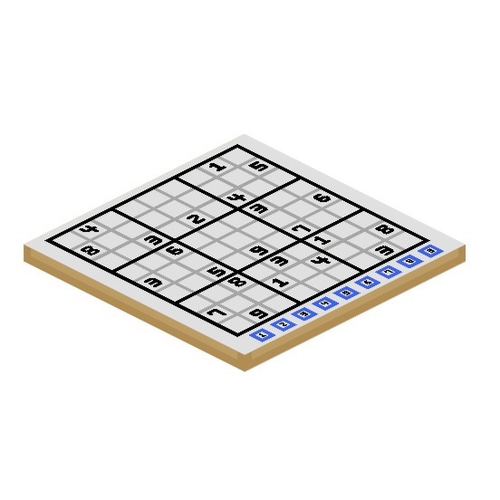
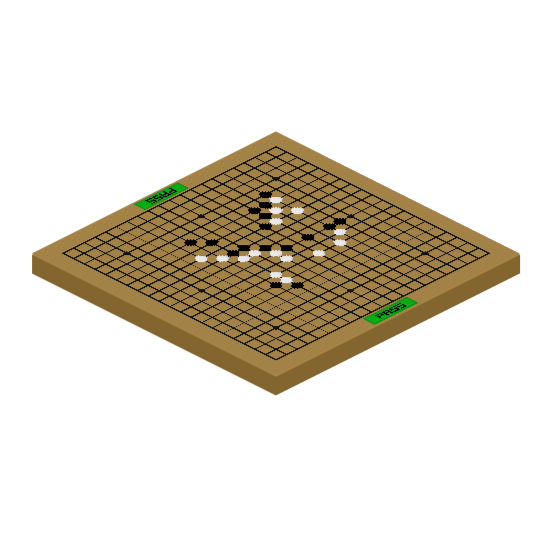
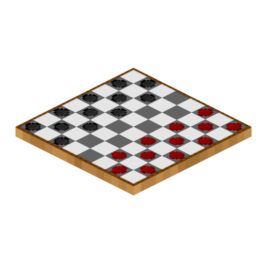
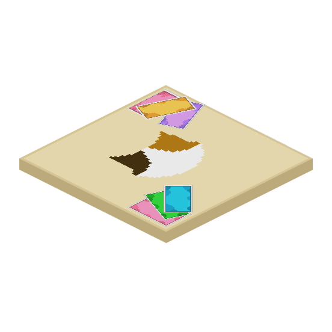
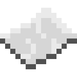

# 🎲 보드게임

<figure><figcaption>
신도시 스폰 앞 위치한 보드게임 NPC
</figcaption></figure>

## 보드게임

보드게임은 고냥이타운의 컨텐츠 중 하나로, 1명 또는 여러 사람이 모여 보드게임을 즐길 수 있으며, 소지금을 사용하여 금액을 걸거나, 시간 등의 세부 설정이 가능합니다.

보드게임을 플레이하기 위해서는 **보드게임 판** 아이템이 필요하며, 신도시 스폰 광장에 위치한 겜블러 NPC를 찾아가 **추천코인 4개**에 구매할 수 있습니다. 또한, 신도시 스폰 앞 보드게임 존에서는 보드게임을 체험해볼 수 있는 공간이 마련되어 있습니다.

### 보드게임 판

.png>)

서버 내에는 8종의 보드게임 판이 존재하며, 각 명칭은 아래와 같습니다. \
보드게임 판은 바닥에 설치할 수 있고, 우클릭하여 플레이할 수 있습니다.

|                                           | 이름   | 인원    | 난이도 | 승리 조건 / 팁                                                           |
| ----------------------------------------- | ---- | ----- | --- | ------------------------------------------------------------------- |
|    | 지뢰찾기 | 1명    | 중   | 
깃발을 세우면서 숨은 지뢰를 다 찾으면 승리 🚩<strong>깃발  = 쉬프트 우클릭</strong>
 |
|         | 스도쿠  | 1명    | 상   | 칸 안에 들어갈 숫자를 정확히 찾으면 승리                                             |
|  | 틱택토  | 2명    | 하   | 가로/세로/대각선 3줄을 만들면 승리                                                |
|  | 커넥트포 | 2명    | 중   | 가로/세로/대각선 4줄을 만들면 승리                                                |
|          | 바둑   | 2명    | 상   | 상대방보다 알집을 많이 만들면 승리                                                 |
| .png>)   | 체스   | 2명    | 상   | 
상대방의 킹을 체크메이트하면 승리 <strong>⏳플레이 시간 조정 필수 !</strong>
       |
|        | 체커   | 2명    | 상   | 상대방의 말을 모두 먹으면 승리                                                   |
|            | 우노   | 2\~8명 | 중   | 모든 카드를 다 내면 승리                                                      |

## 플레이 방법

대기방을 만들면 우클릭으로 상대방이 입장할 수 있으며, 플레이 방법은 각 보드게임의 룰을 따릅니다.

### 게임 만들기 (2\~8명)

#### &#x20;🎲빠른 시작

보드게임 판을 우클릭하고 ✅<mark style="color:green;">**게임 만들기!**</mark> 버튼을 눌러 대기방을 만들 수 있습니다.

**⚙️ 게임 설정**&#x20;

&#x20;**게임 만들기 창에서** 🔼🔽 **단추를 클릭하여** **배팅 금액을 걸거나, 팀을 설정하거나, 플레이 시간을 조정할 수 있습니다.**  &#x20;

<figure><figcaption>
보드게임 빠른 시작
</figcaption></figure>

| 아이콘                                        | 역할          | 설명                                                                                                                                           |
| ------------------------------------------ | ----------- | -------------------------------------------------------------------------------------------------------------------------------------------- |
|    | **소지금 걸기**  | 
<strong>클릭</strong>하여 <strong>내기에 걸</strong> <strong>소지금을 조정</strong>할 수 있고,

<strong>상/하단에 위치한 단추</strong>를 눌러 소지금을 변경할 수 있습니다.
 |
|          | **팀 변경하기**  | **상/하단에 위치한 단추**를 눌러 팀을 변경할 수 있습니다.                                                                                                          |
| .webp>) | **시간 조정하기** | **상/하단에 위치한 단추**를 눌러 **시간을 조정**할 수 있습니다.                                                                                                     |

### 참가하기 (2\~8명)

<figure><figcaption>
보드게임 판을 우클릭하면 뜨는 입장 GUI
</figcaption></figure>

보드게임 판을 우클릭하고 <mark style="color:green;">**게임 참여**</mark> 버튼을 눌러 대기방에 입장합니다.

왼쪽 GUI 창에서 **게임 설정**을 볼 수 있으며, 플레이어의 준비가 완료되면 시작합니다.

### 게임 나가기

<figure><figcaption>
보드게임 판을 좌클릭하면 뜨는 퇴장 GUI
</figcaption></figure>

언제든지 **보드게임 판을** **좌클릭**하여 게임에서 퇴장할 수 있습니다.

진행 도중 **보드게임 판과 일정 거리 이상 떨어지거나, 퇴장할 경우 상대방이 부전승**합니다.

## 변경사항

| 날짜             | 설명                                                                             |
| -------------- | ------------------------------------------------------------------------------ |
| **2022.09.20** | 
보드게임 8종이 추가되었습니다.
<ul><li>틱택토, 커넥트포, 체커, 체스, 지뢰찾기, 스도쿠, 우노, 바둑</li></ul> |
| 2023.02.11     | 보드게임의 텍스쳐가 변경되었습니다.                                                            |
