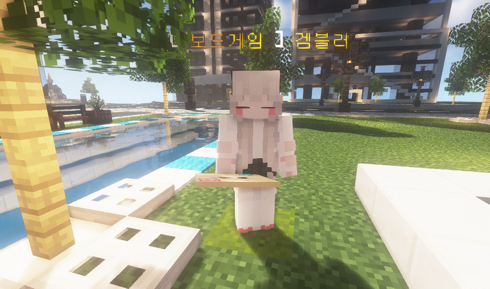
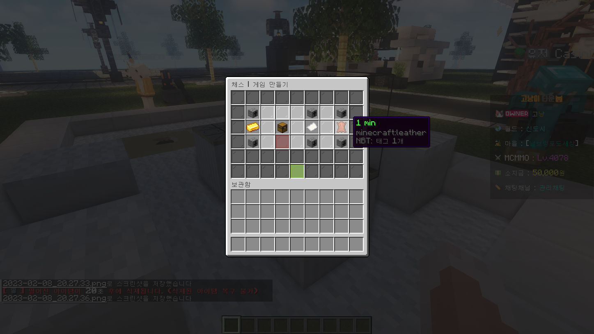

# 🎲 보드게임

* **🎲 보드게임 종류**: **체스, 바둑, 스도쿠, 지뢰찾기, 체커, 틱택토, 우노 등 9종**
* ****:white\_check\_mark: **판매 장소** : **신도시 스폰 앞 npc** (추천코인 4개로 교환 가능)

\-----------------------------------------------------------------------------------------------------

## 1. 설명

보드게임은 고냥이타운 내의 컨텐츠 중 하나로, 사람들과 모여 게임할 수 있으며, 소지금을 사용하여 승부를 걸 수 있다는 특징이 있습니다. 서버 내에는 8종의 보드게임이 있으며, 게임별로 1\~12명의 사람이 플레이할 수 있습니다. 신도시월드 스폰 앞 보드게임 NPC에게 찾아가 말을 걸어 보드게임 판을 구매할 수 있습니다.

### 1-1. 보드게임의 종류

ㅂ

|                                         | 이름 | 인원 | 승리 조건                |
| --------------------------------------- | -- | -- | -------------------- |
| .png>) | 체스 | 2명 | 가로/세로/대각선 3줄을 만들면 승리 |
|                                         |    |    |                      |
|                                         |    |    |                      |

구매 방법

신도시 스폰 앞 보드게임 NPC에게 찾아가 말을 걸어 **보드게임 판**을 **구매**할 수 있습니다.

<figure><figcaption>
신도시 스폰 앞 위치한 보드게임 NPC
</figcaption></figure>

<figure><figcaption></figcaption></figure>

## 2. 플레이 방법

보드게임 판을 **부동산 영역 안에서 우클릭**하면 바닥에 설치할 수 있습니다.

하단 <mark style="color:green;">**게임 만들기!**</mark> 버튼을 눌러 방을 만들고, 상대방도 보드게임에 우클릭하여 **버튼을 눌러 참가**할 수 있습니다.&#x20;

보드게임을 플레이 할 시, **우클릭으로 상호작용** 할 수 있습니다.&#x20;

<figure><figcaption>
주최자 시점 - 우클릭 후 , 게임 만들기 버튼 클릭
</figcaption></figure>

<figure><figcaption>
주최자 시점 - 오른쪽 머리 아이콘을 클릭하여 대기방에 입장하기
</figcaption></figure>

<figure><figcaption>
주최자 시점 - 모든 참가자 모집이 완료되었다면, 모든 인원이 준비 시 시작합니다.
</figcaption></figure>

### 2-1. 설정 및 배팅

&#x20;🔼🔽 **단추를 클릭하여** **배팅 금액을 걸거나, 팀을 설정하거나, 플레이 시간을 조정**할 수 있습니다.

주최자 시점에서 게임 준비 창에서 해당 항목에 커서를 올려 상세 설정을 조정할 수 있습니다.

<figure><figcaption></figcaption></figure>

| 아이콘                                        | 역할          | 설명                                                                                                                                           |
| ------------------------------------------ | ----------- | -------------------------------------------------------------------------------------------------------------------------------------------- |
|    | **소지금 걸기**  | 
<strong>클릭</strong>하여 <strong>내기에 걸</strong> <strong>소지금을 조정</strong>할 수 있고,

<strong>상/하단에 위치한 단추</strong>를 눌러 소지금을 변경할 수 있습니다.
 |
|          | **팀 변경하기**  | **상/하단에 위치한 단추**를 눌러 팀을 변경할 수 있습니다.                                                                                                          |
| .webp>) | **시간 조정하기** | **상/하단에 위치한 단추**를 눌러 **시간을 조정**할 수 있습니다.                                                                                                     |

### 2-2. 게임 나가기

언제든지 **보드게임 판을** **좌클릭**하여 게임에서 퇴장할 수 있습니다.

진행 도중 **보드게임 판과 일정 거리 이상 떨어지거나, 퇴장할 경우 상대방이 부전승**합니다.

<figure><figcaption></figcaption></figure>

### 3.역사

| 날짜         | 설명                                                                             |
| ---------- | ------------------------------------------------------------------------------ |
| 2022.09.20 | 
보드게임 8종이 추가되었습니다.
<ul><li>틱택토, 커넥트포, 체커, 체스, 지뢰찾기, 스도쿠, 우노, 바둑</li></ul> |
| 2023.02.11 | 각종 버그사항이 수정되었으며, 보드게임의 텍스쳐가 리메이크되었습니다.                                         |
