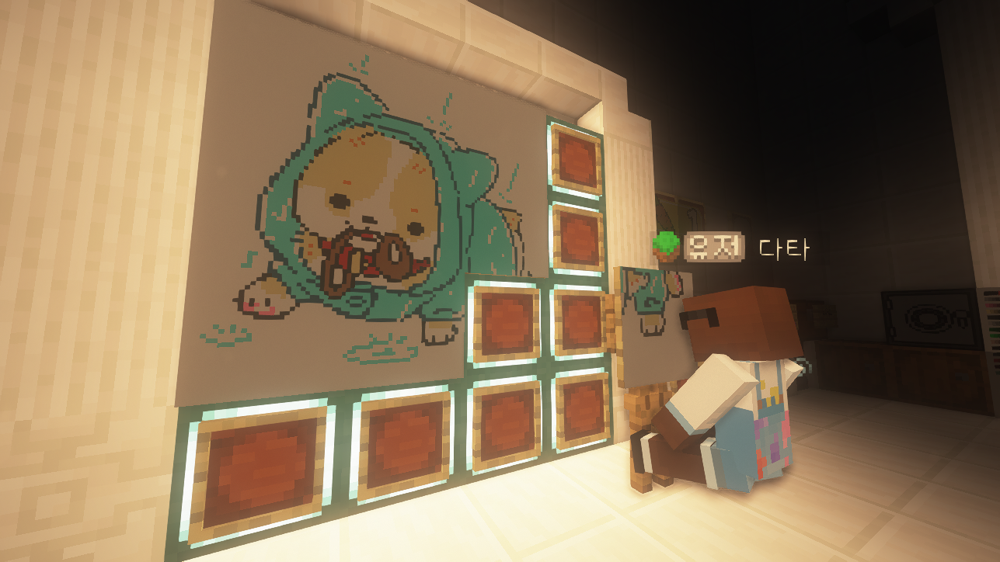
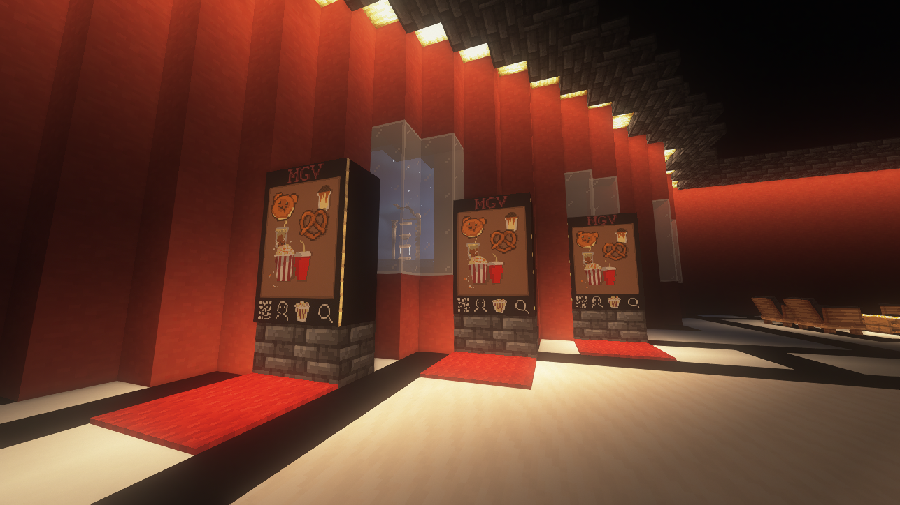
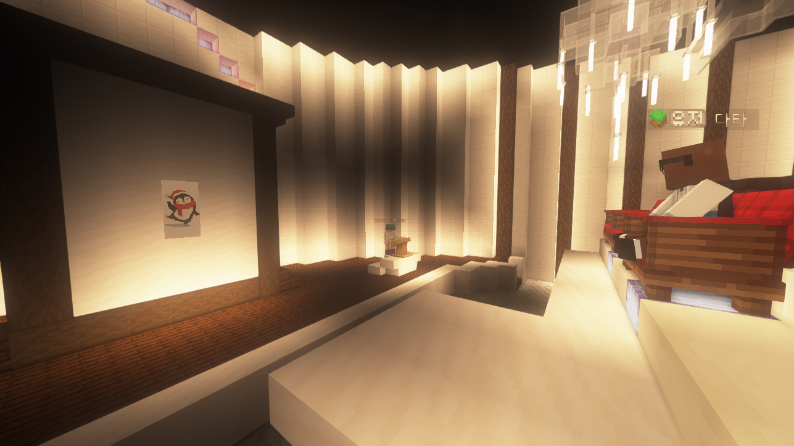

# 🎨 그림

<figure><figcaption>
앉아서 그림을 그리는 모습
</figcaption></figure>

## 그림

그림은 고냥이타운의 예술 컨텐츠 중 하나로, **이젤과 캔버스**를 이용하여 이젤에 앉아 그림을 그리고 공유하는 컨텐츠입니다.  **/art** 명령어를 활용하여 레시피, 염료, 도구 등 **그림에 필요한 도움말**을 확인할 수 있습니다.

## 그림 그리기

<figure><figcaption></figcaption></figure>

먼저 그림을 그리기 위해서는 **이젤과 캔버스**가 필요합니다. 해당 물품은 작물코인 상점에서 작물코인으로구매할 수 있으며, 구매 후 자신의 부동산에서 **/res set** 명령어를 입력하고 **artmap-use 및 artmap-place** 권한을 허용해주어야 설치가 가능합니다.\
이젤을 설치하고,  그 위에 캔버스를 올려놓으면 그림을 그릴 준비가 완료됩니다.

### 염료와 도구

그림을 그리는데 필요한 **염료와 도구**는 이젤에 앉으면 기본으로 제공됩니다. 각각의 색깔을 인벤토리에 가져와 캔버스에 우클릭하면 그림을 그릴 수 있습니다. \
도구를 활용하면 **회전/스포이드/채우기/어둡게/밝게** 등의 추가 기능을 활용할 수 있습니다.

### 그림 저장하기

그림을 다 그렸으면 이젤에 앉은 상태에서 /art save (그림명)을 입력하여 작품의 제목을  생성할 수 있으며, 저장이 완료됩니다.\
**(\*저장을 하지 않으면 그림의 저장 및 복구가 불가능합니다.)**&#x20;

## 그림 활용하기

<figure><figcaption>
그림을 사용하여 만든 영화관 포스터
</figcaption></figure>

<figure><figcaption>
유저간 이루어지는 미술작품 경매 (스텔라 경매장)
</figcaption></figure>

<figure><figcaption>
디스코드 그림공간을 활용하여 나만의 그림 자랑하기
</figcaption></figure>

그림은 **액자** 또는 작물코인 상점에서 판매하는 **투명액자 / 발광 투명액자**를 이용하여 다양한 장식 및 조형물로 활용할 수 있습니다.  또한, 블록을 활용하여 이젤을 겹쳐 설치할 수 있으며, 대형 그림을 제작할 수 있습니다.&#x20;

* **거래 게시판을 통해 작품을 거래하거나, 커미션을 받거나, 미술관을 만들거나, 바닥재나 벽재 장식으로 사용해 보세요 !** \
  ****

## 변경사항

| 날짜             | 설명                                                   |
| -------------- | ---------------------------------------------------- |
| **2022.06.19** | <ul><li> <strong>그림 컨텐츠</strong>가 추가되었습니다.</li></ul> |

