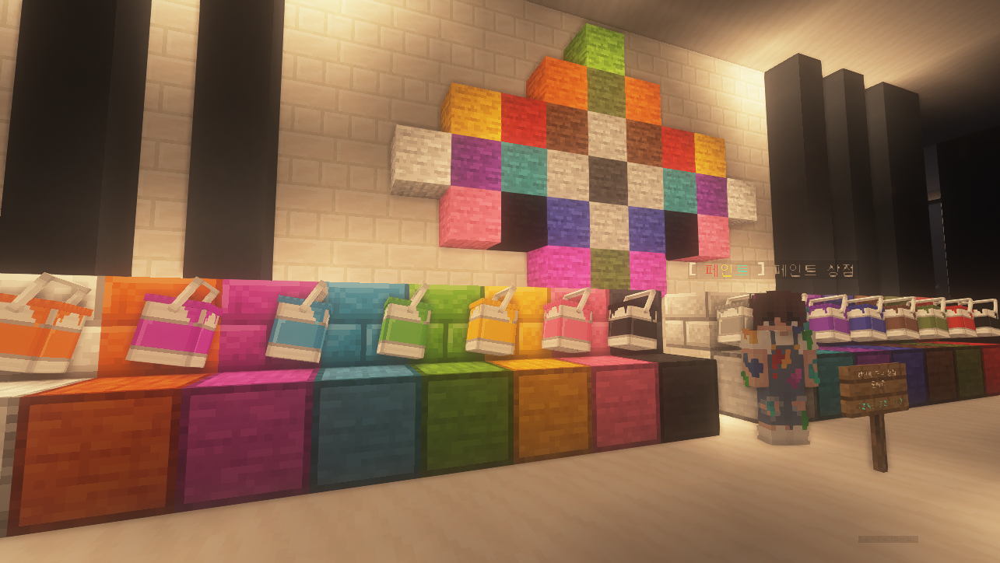

# 🪄 건축

<figure><figcaption>
신도시 상가 2층에 위치한 페인트 도구 상점
</figcaption></figure>

<figure><figcaption>
페인트는 조합으로 획득할 수 있습니다
</figcaption></figure>

<figure><figcaption>
페인트 조합법은 /레시피 명령어로도 볼 수 있습니다
</figcaption></figure>

> 🖌️ 페인트란 무엇인가요?

기존 마인크래프트에 존재하지 않는 다양한 **색깔 건축 블럭**을 추가하는 업데이트입니다.\
**/레시피** 명령어를 통해 **페인트 블럭의 조합법**을 볼 수 있습니다.

> 🖌️ 페인트 블록은 어떻게 얻을 수 있나요?

* 3x3 제작대에 페인트 적용 아이템을 외곽에 두르고, 가운데 염료 아이템 하나를 올리면 해당하는 아이템의 페인트 블록을 얻을 수 있습니다.
* **페인트 적용 아이템: 참나무 판자, 벽돌, 석재 벽돌, 금 간 석재 벽돌, 이끼 낀 석재 벽돌, 조각된 석재 벽돌, 발광석, 돌, 매끄러운 돌, 조약돌, 이끼 낀 조약돌, 네더 벽돌, 금 간 네더 벽돌, 조각 된 네더 벽돌**

> ❗사용시 알아두어야 할 점이 있나요?

* **기존 건축 블록보다 설치속도가 약간 느립니다.**
* **돌 아이템은 곡괭이,나무 아이템은 도끼 도구로만 캘 수 있습니다.**
* **표지판을 설치할 수 없습니다.**

## 변경사항

| 날짜         | 설명                                                                                      |
| ---------- | --------------------------------------------------------------------------------------- |
| 2022.12.31 | 
<strong>페인트 시스템</strong>이 업데이트 되었습니다
<ul><li>224개의 신규 블럭과 조합식이 추가되었습니다.</li></ul> |

