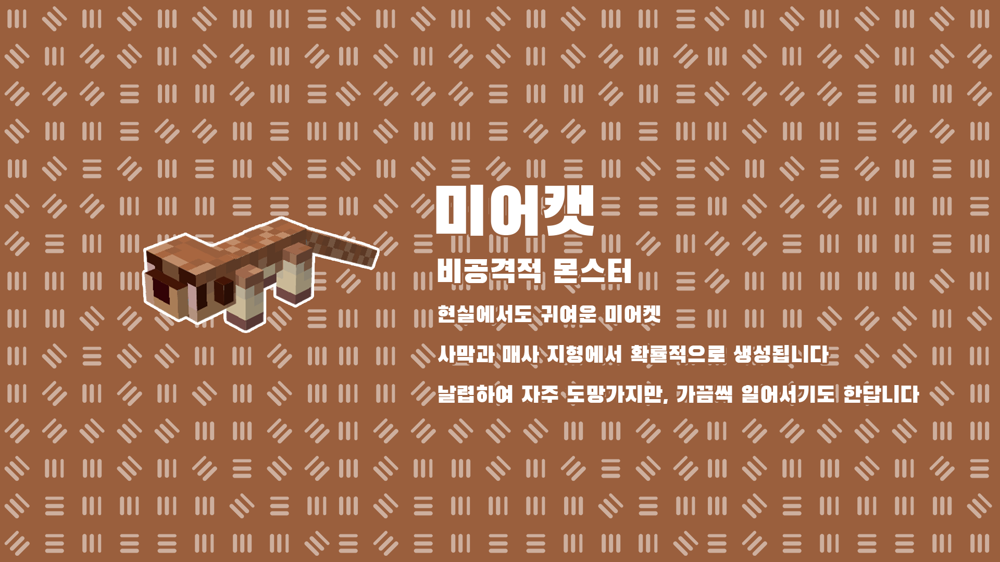
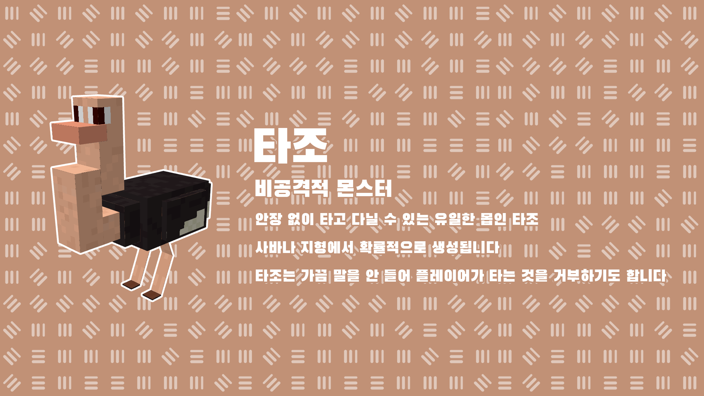
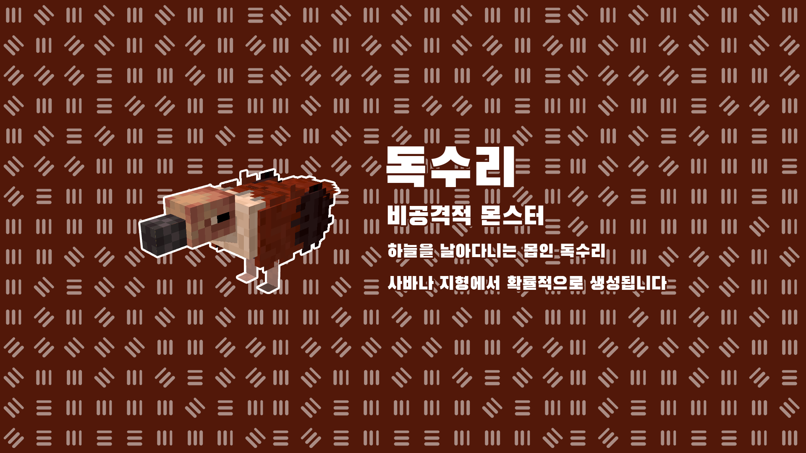
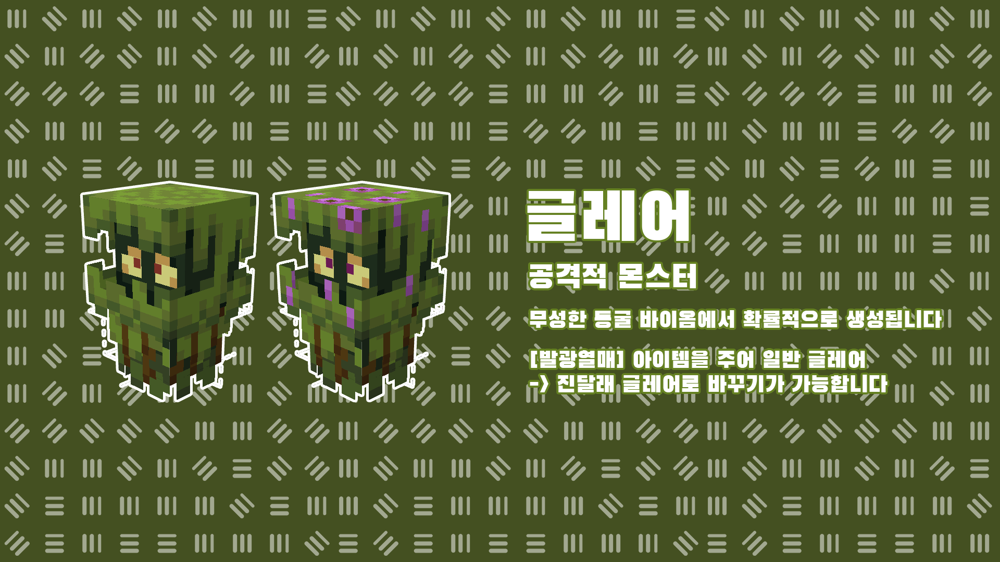

# 🦊 동물 / 몬스터


**커스텀 몬스터의 경우, 마인크래프트 공식이 아님을 유의바랍니다.**

🔸 커스텀 몬스터에 대해 고냥이타운은 마인크래프트와 관련이 없습니다.


* 기존 야생과 어울리도록 마인크래프트 본연의 야생을 살렸습니다.
* 커스텀 몬스터는 출몰하는 일부 등장하는 바이옴이 다릅니다.

<figure><figcaption></figcaption></figure>

<figure><figcaption></figcaption></figure>

<figure><figcaption></figcaption></figure>

<figure><figcaption></figcaption></figure>

<figure><figcaption></figcaption></figure>

<figure><figcaption></figcaption></figure>

<figure><figcaption></figcaption></figure>

7\. 빙하학자 (비공격적)

* 마인크래프트 던전에서 발견되는 우두머리인 빙하학자! (툰드라, 얼어붙은 강, 눈 덮인 타이가, 바람이 세찬 숲) 지형에서 확률적으로 생성됩니다.

<figure><figcaption></figcaption></figure>
