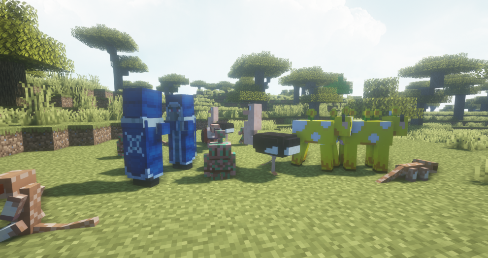
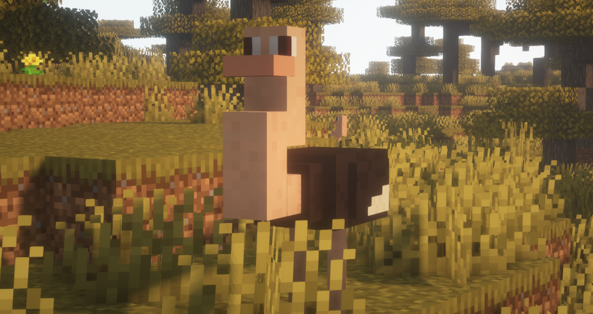
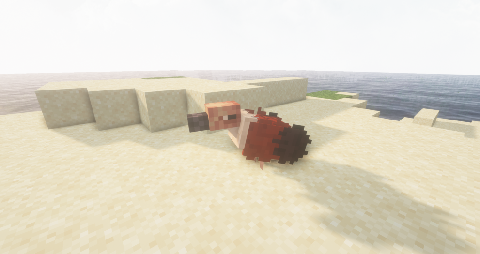
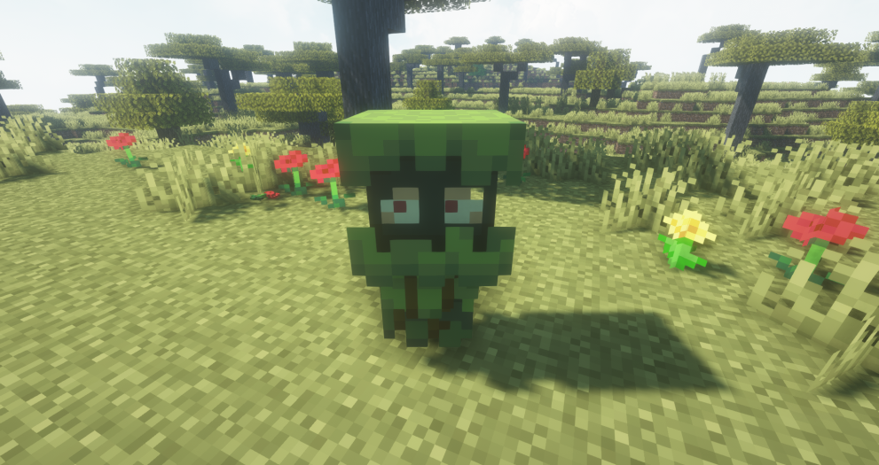
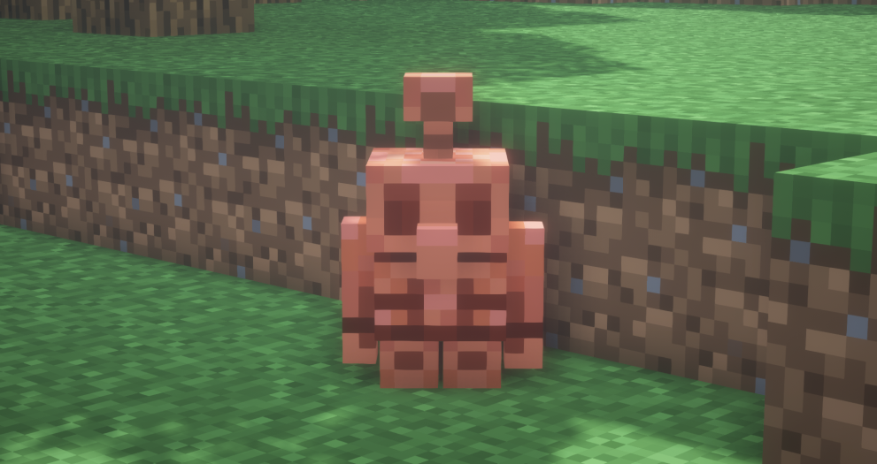
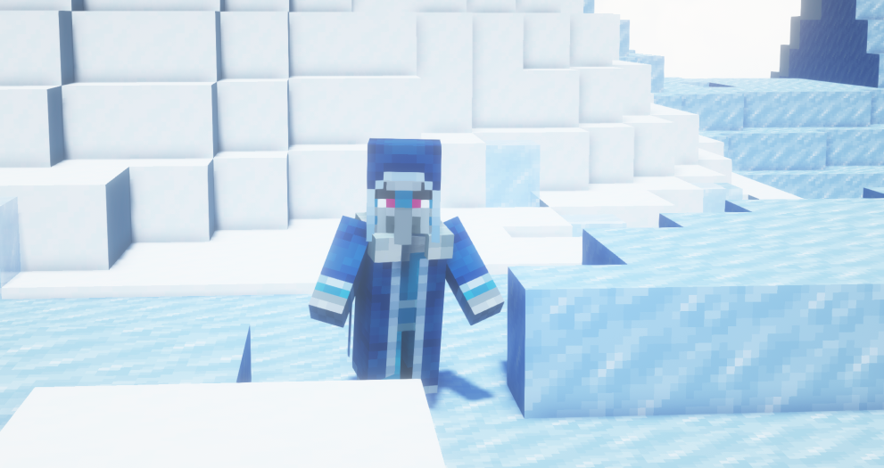
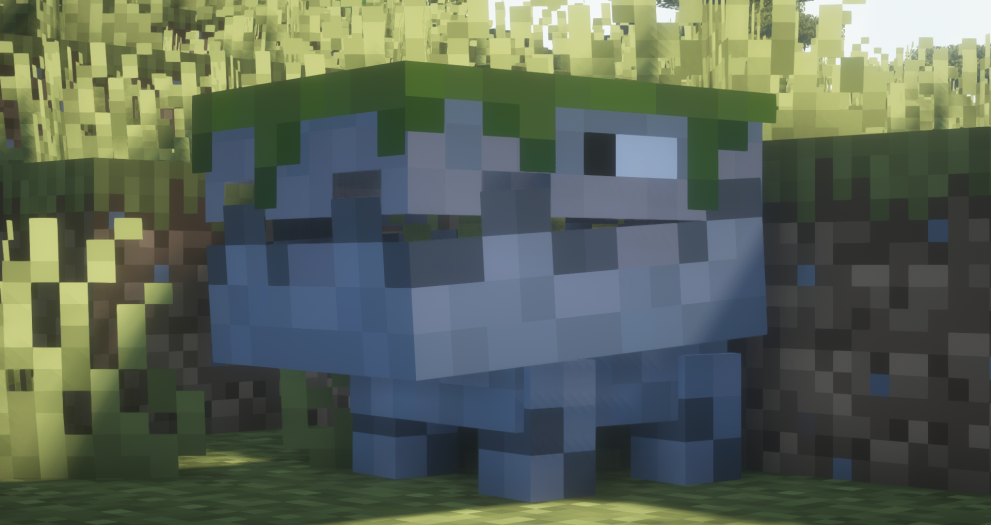

# 🦊 동물 / 몬스터

<figure><figcaption>
서버 내에서 볼 수 있는 커스텀 몹, 왼쪽부터 미어켓, 빙하학자, 구리골렘과 독수리, 타조, 무블룸 순서 
</figcaption></figure>


**커스텀 몬스터의 경우, 마인크래프트 공식이 아님을 유의바랍니다.**

🔸 커스텀 몬스터에 대해 고냥이타운은 마인크래프트와 관련이 없습니다.


* 기존 야생과 어울리도록 마인크래프트 본연의 야생을 살렸습니다.
* 커스텀 몬스터는 출몰하는 일부 등장하는 바이옴이 다릅니다. \\

1\. 미어켓 (비공격적, 끈 사용 가능)

* 현실에서도 귀여운 미어켓! 사막과 매사 지형에서 확률적으로 생성됩니다.
* 날렵하여 자주 도망가지만, 가끔씩 일어서기도 한답니다!

<figure><figcaption></figcaption></figure>

2\. 타조(비공격적, 끈 사용 가능)

* 안장 없이 타고 다닐 수 있는 유일한 몹인 타조! 사바나 지형에서 확률적으로 생성됩니다.
* 타조는 가끔 말을 안 들어 플레이어가 타는 것을 거부하기도 합니다.

<figure><figcaption></figcaption></figure>

3\. 무블롬 (민들레소, 비공격적, 끈 사용 가능)

* 이번엔 소가 민들레가 되었네요! 꽃 숲에서 확률적으로 생성됩니다.
* 노란색과 민들레를 제외하고는 버섯 소와 같으나 가위질을 할 수 없습니다!
* 다른 색깔의 꽃을 줘 색깔을 변경할 수 있습니다.

\[민들레] : 노란 소 (기본) / \[빨간색 튤립]: 빨간 소 /\[주황색 튤립]: 주황 소

\[파란색 난초]: 파란 소 / \[파꽃]: 보라 소

<figure><figcaption></figcaption></figure>

4\. 독수리(비공격적, 끈 사용 가능)

* 하늘을 날아다니는 몹인 독수리! 사바나 지형에서 확률적으로 생성됩니다.

<figure><figcaption></figcaption></figure>

5\. 글레어 (비공격적, 끈 사용 가능)

* 작은 유령 같이 생긴 몹인 글레어는 무성한 동굴 바이옴에서 확률적으로 생성됩니다.
* 글레어는 여러분을 해치지 않으므로 탐험하다가 글레어를 마주쳐도 놀라지 마세요!
* \[발광열매] 아이템을 주어 일반 글레어 => 진달래 글레어로 바꾸기가 가능합니다.

<figure><figcaption></figcaption></figure>

6\. 구리 골렘(중립적)

* 작고 귀엽지만 건들면 무는 구리 골렘, 철 골렘을 소환할 때 사막과 매사 지형에서 확률적으로 생성됩니다!
* 시간이 지나면 자연적으로 산화됩니다.

<figure><figcaption></figcaption></figure>

7\. 빙하학자 (비공격적)

* 마인크래프트 던전에서 발견되는 우두머리인 빙하학자! (툰드라, 얼어붙은 강, 눈 덮인 타이가, 바람이 세찬 숲) 지형에서 확률적으로 생성됩니다.

<figure><figcaption></figcaption></figure>

8\. 그레이트 헝거(공격적)

* 거대한 입으로 모든 것을 집어삼키는 그레이트 헝거! (점적석 동굴, 무성한 동굴, 늪 지형)에서 확률적으로 생성됩니다.
* 공격 속도가 둔한 대신 아프므로 마주치지 않게 조심하세요!

<figure><figcaption></figcaption></figure>
