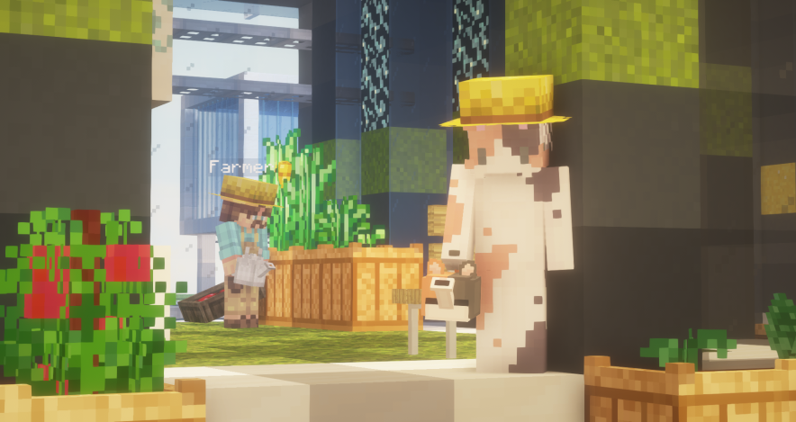

# 🍅 뉴작물


**청크당 작물 수 제한 안내**

작물이 자라는 방식로 인해, **청크당 심을 수 있는 작물의 수가 최대 32개**로 제한되어 있습니다.

스프링쿨러는 청크당 최대 8개까지 설치 가능합니다



**작물을 캘 시 맨손 또는 괭이를 들고 우클릭으로 캘 수 있습니다.**


<figure><figcaption>
뉴작물 상점에서는 작물의 생장 단계와 판매하는 아이템을 볼 수 있다.
</figcaption></figure>

<figure><figcaption>
서버 내 존재하는 다양한 뉴작물 (2022.10.30)
</figcaption></figure>

<figure><figcaption>
2022.11.7~ 신규 뉴작물
</figcaption></figure>



> 🍅 뉴작물이란?

* 고냥이 타운만의 커스텀 농작물 시스템을 말하며, 소규모 농사에 적합합니다.
* 뉴작물은 각 작물마다 "성장 단계" 라는 것이 존재하며, 마인크래프트 시간으로 하루당 1단계씩 성장합니다. (물을 안 줄 경우, 성장 속도가 감소합니다.)
* 작물코인 및 MCMMO 경험치가 드롭됩니다.
* 뉴작물은 가공 과정을 거쳐 요리에 사용할 수 있습니다.
* **즉, 뉴작물 상점에서 전용 토양을 구매하여 전용 씨앗을 심고, 물뿌리개 또는 스프링쿨러로 물을 충분히 준 상태에서 하루마다 1단계씩 성장합니다.**

> 🍇 뉴작물의 종류

* 기존: 토마토, 포도, 마늘, 양배추, 빨간 고추, 옥수수
* 신규: 무, 파인애플, 오렌지, 딸기, 바나나, 레몬, 석류 , 상추

> 🌱 뉴작물을 기르는 법

1. 고냥이타운 도시월드 스폰앞에서 농부 NPC를 찾아가 구매합니다.

* 농부 NPC는 뉴작물의 전용 토양, 물뿌리개, 비료, 씨앗 등을 판매하고 있으며, 작물코인을 통해 구매가 가능합니다.

<figure><figcaption></figcaption></figure>

각 상점에 대한 설명입니다.

<필요 아이템>

* **뉴작물 씨앗 : 농사에 필수적이며, 작물코인을 교환하여 획득할 수 있습니다.**
* **물뿌리개 (구리, 철 등): 작물에 물을 주어야 농작물이 잘 자라므로 필수적이며, 작물코인을 교환하여 획득할 수 있습니다.**
* **토양: 작물을 심을때는 전용 토양이 필수입니다.**

< 도움이 되는 아이템>

* 스프링쿨러 : 땅에 설치하고 물을 채워 넣어 자동으로 급수할 수 있습니다. 작물 교환권(작물코인 128개 교환)으로 사용할 수 있습니다. 반경은 인접 1블록입니다.
* 비료: 작물의 최대 드롭률을 1 증가시키며, 작물을 심기 전 토양에 우클릭하여 비료를 줄 수 있습니다.

<장식 및 치장>

* 농부 모자, 허수아비는 <mark style="color:green;">치장 및 장식 아이템</mark>입니다.

<figure><figcaption></figcaption></figure>

2\. 본인의 부동산에서 토양에 씨앗을 심고 물을 줍니다.

<figure><figcaption></figcaption></figure>

물뿌리개는 물가에 다가가 우클릭으로 물을 채워 넣을 수 있습니다.

3\. 기다리고 다 자라면 수확합니다.

* 물 뿌리개로 물을 준 경우, 작물이 1단계 성장할때마다 땅이 마르므로 꾸준히 물을 주세요!
* 스프링쿨러를 이용한 경우, 물을 채워 넣었는지 우클릭으로 확인하세요!

<figure><figcaption></figcaption></figure>

* 상점 판매 및 요리에 사용할 수 있으며, 부산물로 작물코인이 드롭됩니다.

> 마무리

* 추천코인 상점에서 고양이 물뿌리개를 판매합니다.
* 끝까지 읽어주셔서 감사합니다!

<figure><figcaption>
스프링쿨러는 특정 시간에 작동하며, 이펙트를 볼 수 있습니다.
</figcaption></figure>

<figure><figcaption>
비료 또한 이펙트가 존재합니다
</figcaption></figure>
