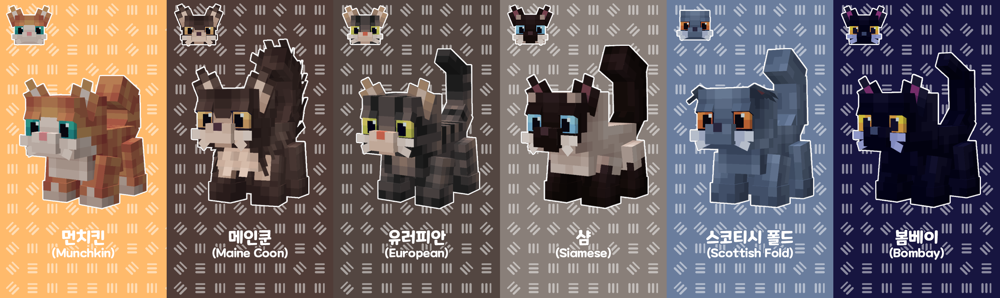
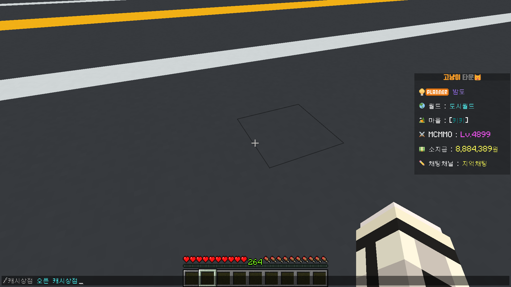
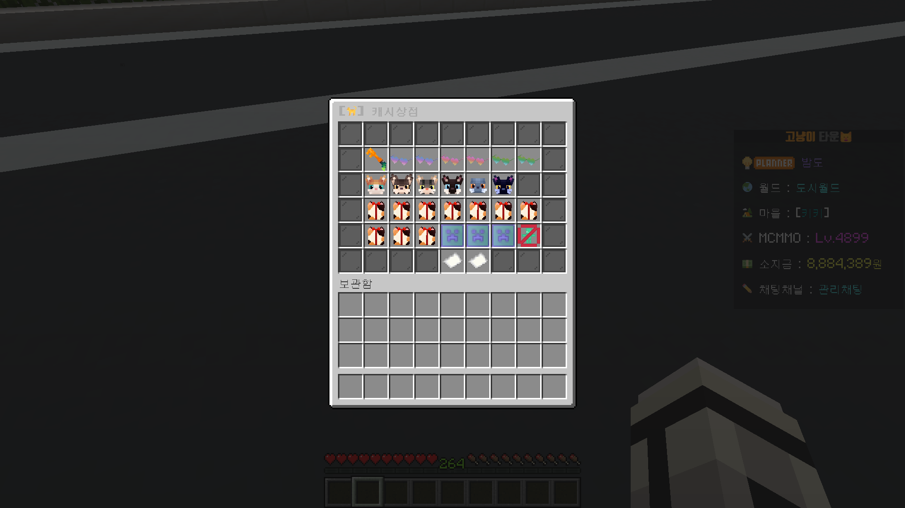
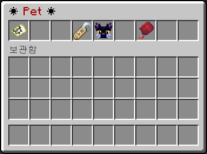

# 🐈 펫

> 펫 종류

<figure><figcaption>
고냥이타운에서 구매할 수 있는 귀여운 펫이에요!
</figcaption></figure>

> 펫 구매 방법

1. 채팅에 <mark style="color:green;">**/캐시상점 오픈 캐시상점**</mark> 이라고 입력해주세요!

<figure><figcaption></figcaption></figure>

2. 캐시상점에 보이는 <mark style="color:green;">**펫(6종)**</mark> 중에서 <mark style="color:green;">**원하는 펫을 선택**</mark>해주세요!

<figure><figcaption></figcaption></figure>

3. 구매를 원한다면 <mark style="color:green;">**연두색 양털을 클릭하고 구매**</mark>해주세요!

<figure><figcaption></figcaption></figure>

> 펫 명령어

1. <mark style="color:green;">**/펫**</mark> 명령어로 펫 GUI를 열 수 있습니다.\
   \- 본인이 가지고 있는 펫을 클릭해주세요

<figure><figcaption></figcaption></figure>

2. 펫에 대한 정보를 확인 할 수 있습니다.

<figure><figcaption></figcaption></figure>

* <mark style="color:blue;">**지도**</mark>**ㅣ**펫 메뉴로 돌아갑니다.
* <mark style="color:blue;">**이름표**</mark>**ㅣ**고양이의 이름을 변경할 수 있습니다.
* <mark style="color:blue;">**펫**</mark>**ㅣ**우클릭으로 상호작용을 할 수 있습니다. (놀아주기 가능)
* <mark style="color:blue;">**털뭉치**</mark>**ㅣ**마우스 오른쪽 버튼을 클릭하여 털뭉치를 던질 수 있습니다.
