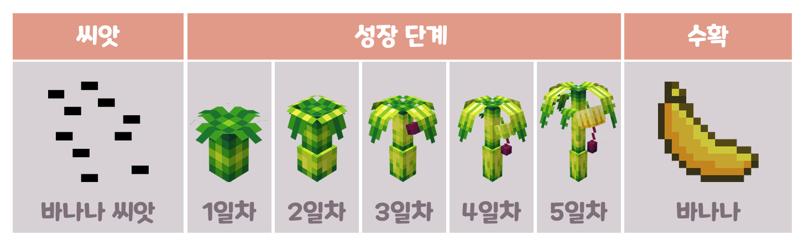
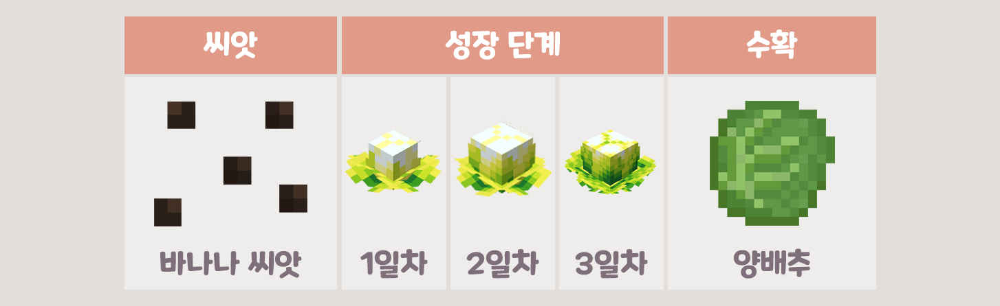
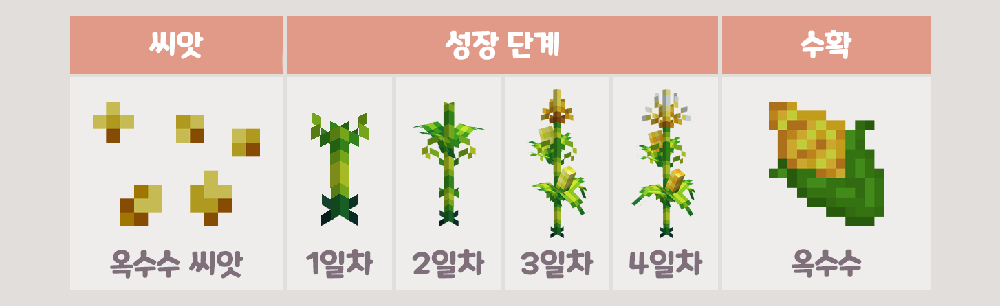

# 🍅 농작물

> 🍅 농작물이란?

* 고냥이타운만의 커스텀농작물 시스템을 말하며, 소규모 농사에 적합합니다.
* 커스텀 농작물은 각 작물마다 "성장 단계" 라는 것이 존재하며, 마인크래프트 시간으로 하루당 1단계씩 성장합니다. (물을 안 줄 경우, 성장 속도가 감소합니다.)
* 작물코인 및 MCMMO 경험치가 드롭됩니다.
* 뉴작물은 가공 과정을 거쳐 요리에 사용할 수 있습니다.
* 즉, 뉴작물 상점에서 전용 토양을 구매하여 전용 씨앗을 심고, 물뿌리개 또는 스프링쿨러로 물을 충분히 준 상태에서 하루마다 1단계씩 성장합니다

> 🍇 농작물의 종류

<figure><figcaption>
바나나의 성장 단계
</figcaption></figure>

<figure><figcaption>
양배추의 성장 단계
</figcaption></figure>

<figure><figcaption>
옥수수의 성장 단계
</figcaption></figure>

> 🌱 뉴작물 기르는 법
