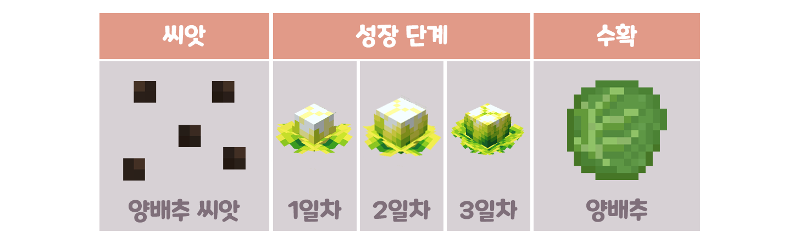
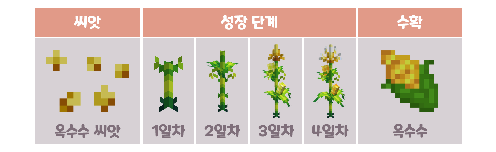

# 🍅 농작물

> 🍅 농작물이란?

* 고냥이타운만의 커스텀농작물 시스템을 말하며, 소규모 농사에 적합합니다.
* 커스텀 농작물은 각 작물마다 "성장 단계" 라는 것이 존재하며, 마인크래프트 시간으로 하루당 1단계씩 성장합니다. (물을 안 줄 경우, 성장 속도가 감소합니다.)
* 작물코인 및 MCMMO 경험치가 드롭됩니다.
* 뉴작물은 가공 과정을 거쳐 요리에 사용할 수 있습니다.
* 즉, 뉴작물 상점에서 전용 토양을 구매하여 전용 씨앗을 심고, 물뿌리개 또는 스프링쿨러로 물을 충분히 준 상태에서 하루마다 1단계씩 성장합니다

> 🌱 커스텀 농작물  기르는 방법

1. 농작물을 기르기 위한 기본 준비물을 구매합니다

2. 본인의 부동산(땅)에서 토양을 설치하고 씨앗을 심은 뒤 물을 줍니다

<figure><figcaption>
<mark style="color:green;"><strong>물뿌리개</strong></mark>는 물가에 다가가 <mark style="color:green;"><strong>우클릭</strong></mark>으로 <mark style="color:blue;"><strong>물</strong></mark>을 채워넣을 수 있습니다
</figcaption></figure>

<figure><figcaption>
<mark style="color:blue;"><strong>물</strong></mark>을 뿌리고 싶은 <mark style="color:orange;"><strong>토양</strong></mark> 위에 <mark style="color:green;"><strong>우클릭</strong></mark>으로 <mark style="color:blue;"><strong>물</strong></mark>을 뿌릴 수 있습니다
</figcaption></figure>

3. 기다리고 다 자라면 수확합니다

* 물 뿌리개로 물을 준 경우, 작물이 1단계 성장할 때마다 땅이 마르므로 꾸준히 물을 주세요!
* 스프링쿨러를 이용한 경우, 물을 채워 넣었는지 우클릭으로 확인하세요!

> 🍇 농작물의 종류

<figure><figcaption></figcaption></figure>

<figure><figcaption></figcaption></figure>

<figure><figcaption></figcaption></figure>

<figure><figcaption></figcaption></figure>

<figure><figcaption></figcaption></figure>

