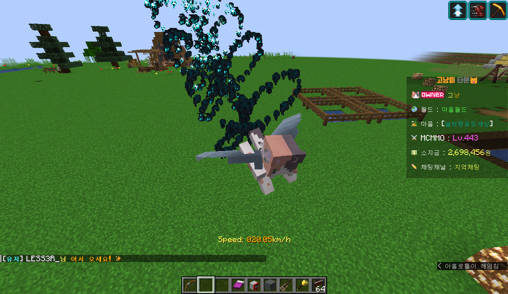
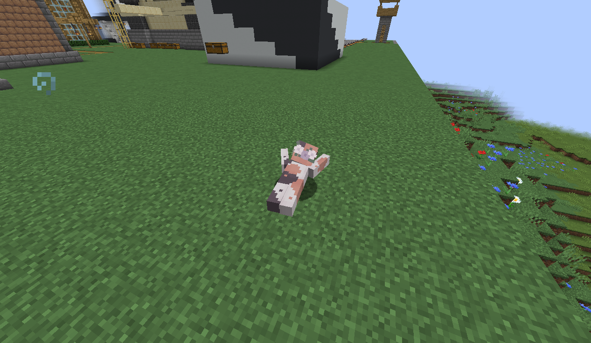

# 💵 후원


**후원 안내**

#### ✅ 고냥이타운의 후원은 EULA 규칙을 위반하지 않으며,  모든 후원금은 개인 목적이 아닌 컨텐츠 제작, 서버 컴퓨터 증축 등 서버를 위해 사용합니다.

#### ✅ 모든 후원 내역은 후원자들에게 투명하게 공개되며, 작은 후원이라도 해주신다면 유저분들이 만족하고 안정적인 서버 운영을 할 수 있도록 최선을 다하겠습니다.


**💸 후원 사이트 (링크를 클릭하세요!)**



**💸 캐시상점**

* **/캐시 확인 : 자신의 캐시를 확인할 수 있습니다.**
* **/캐시상점 오픈 캐시상점** 명령어로 확인할 수 있으며, <mark style="color:green;">**치장 아이템 및 색/한닉/커스텀칭호 교환권**</mark>을 판매합니다.

**💸 누적 후원 보상**

* 고냥이 타운을 지지해주셔서 감사합니다:)
* 누적 후원 시 <mark style="color:green;">**EULA를 준수하는 선**</mark>에서 <mark style="color:green;">**추가 인센티브를 부여**</mark>하고 있습니다.&#x20;
* 아래 탭을 눌러 **누적 후원금액 당 역할**을 보실 수 있습니다.
*   **커스텀 갑옷/겉날개 스킨은 1회에 한하여 (/후원교환) 명령어를 통해 교환이 가능합니다**

    ㄴ  **EULA 준수를 위하여 스킨이 씌워진 아이템과 1:1로 교환되며, 인첸트 옮기기가 가능합니다.**




**누적 후원 20000\~45000원** 달성 시 **역할 및 권한이 지급**됩니다.



**데코레이션 머리는 중복 설치가 불가능합니다.**

가까운 거리에서 중복 설치가 불가능합니다.


****

💸 **고양이 귀 지급**

* <mark style="color:orange;">**고양이 귀 치장 아이템**</mark>**을 지급합니다.**&#x20;

<figure><figcaption>
누적 2만원 후원 보상
</figcaption></figure>

💸 **인게임 이미지 추가 가능**&#x20;

<figure><figcaption></figcaption></figure>

* **인게임 이미지는 디스코드 **<mark style="color:orange;">**《🐱ㆍ후원역할-신청》**</mark> **게시판을 통해 **<mark style="color:orange;">**최대 3개까지 추가 가능**</mark>**하며, 블록 5x5 사이즈 이하만 가능합니다.** &#x20;
* **서버 규칙을 위반하는 이미지 신청 시 보류 및 취소될 수 있습니다.**

****

💸 **데코레이션 머리 소환 가능 (/hdb)**

<figure><figcaption></figcaption></figure>

* **데코레이션 머리는 기본적으로 거래 및 양도할 수 없으며, 자기 자신만 사용이 가능합니다.**&#x20;




**누적 후원 50000\~145000원** 달성 시 **역할 및 권한이 지급**됩니다.


<mark style="background-color:purple;">****</mark>

🐾 ** **<mark style="background-color:purple;">**\[**</mark><mark style="background-color:purple;">🐾</mark><mark style="background-color:purple;">**발자국]**</mark>** 칭호 지급**

* **5만원 이상 후원시,  발자국 칭호를 지급합니다.**&#x20;

****

🐾 ** **<mark style="color:orange;">**커스텀 갑옷 스킨 사이버 세트**</mark>** 교환 가능**

* **무기스킨도 포함하여 지급합니다.**&#x20;

<figure><figcaption></figcaption></figure>

🐾 **일반 파티클 (/h) 사용 가능**&#x20;

<figure><figcaption></figcaption></figure>

* **13종의 기본 파티클이 제공되며, 클릭만으로 간편하게 파티클 설정을 할 수 있습니다.**&#x20;

****

🐾 **발광(/eglow)파티클 사용 가능**&#x20;

<figure><figcaption></figcaption></figure>

* **총 18종(기본 16+이벤트 2) 의 다양한 색깔의 발광 파티클을 만나보세요!**&#x20;




**누적 후원 150000\~295000원** 달성 시 **역할 및 권한이 지급**됩니다.



**커스텀 겉날개 스킨은 플레이어가 텍스쳐를 보려면 옵티파인이 필요하며, 옵티파인 없이 볼 수 있는 알려진 방법이 없습니다.**&#x20;



**어그로 및 랙이 걸리는 과한 파티클 / 변장은 추후 수정될 수 있습니다.**&#x20;


****

<mark style="background-color:yellow;">**🐶**</mark>**  **<mark style="background-color:yellow;">**\[🐶강아지]**</mark>** 칭호 지급**&#x20;

* **15만원 이상 후원시,  강아지 칭호를 지급합니다.**&#x20;

****

<mark style="background-color:yellow;">**🐶**</mark>**  **<mark style="color:orange;">**커스텀 겉날개 스킨**</mark>**  교환 가능**

.png>)

<mark style="background-color:yellow;">**🐶**</mark>** 고급 파티클(/pp) 사용 가능**&#x20;

<figure><figcaption></figcaption></figure>

* **88종의 파티클과 22종의 다양한 상호작용( 블럭을 부술 때/ 활을 쏠때 /겉날개를 쓸 때) 각각의 상호작용이 가능합니다.** &#x20;

****

<mark style="background-color:yellow;">**🐶**</mark>** 몹,동물 변장(/dis) 사용 가능** &#x20;

<figure><figcaption></figcaption></figure>

* **약 30+종의 다양한 바닐라 동물로 변장할 수 있습니다.**




**누적 후원 300000\~495000원** 달성 시 **역할 및 권한이 지급**됩니다.


🦊 ** **<mark style="background-color:yellow;">**\[여우🦊]**</mark>** 칭호 지급**

* **30만원 이상 후원시, 여우 칭호를 지급합니다. (그라데이션 적용)**

****

🦊 **치장아이템 전용 수주권 1개**

* **서버 내에서 직접 제작해드리는 치장아이템 전용 수주권을 1개 지급합니다.   (커스텀 미니미를 제외한 치장류 아이템)**
* <mark style="color:orange;">**디스코드 《🐱ㆍ후원역할-신청》**</mark> **게시판을 통해 신청이 가능합니다.**

****

🦊 **엎드리기 / 눕기 / 회전 이모트 추가**&#x20;

<figure><figcaption>
눕기 사용 장면
</figcaption></figure>

<figure><figcaption>
회전 사용 장면
</figcaption></figure>

| 명령어        | 내용                          |
| ---------- | --------------------------- |
| **/crawl** | **사용 시, 뒤로 누울 수 있습니다.**     |
| **/lay**   | **사용 시, 앞으로 누울 수 있습니다.**    |
| **/spin**  | **사용 시, 제자리에서 회전이 가능합니다.**  |




**누적 후원 500000\~** 달성 시 **역할 및 권한이 지급**됩니다.


😺 <mark style="background-color:orange;">\[고양이😺]</mark> <mark style="color:orange;"></mark> 칭호 지급

* **50만원 이상 후원시, 고양이 칭호를 지급합니다. (그라데이션 적용)**

****

😺 **치장아이템 전용 수주권 1개  or 자신의 스킨을 본딴  커스텀 미니미 제작**

* **치장아이템 전용 수주권 1개 또는 커스텀 미니미 1개 중 선택하여 신청할 수 있습니다.**&#x20;
* <mark style="color:orange;">**디스코드 《🐱ㆍ후원역할-신청》**</mark> **게시판을 통해 신청이 가능합니다.**

****

😺 <mark style="color:orange;">**커스텀 갑옷 스킨 레드 사이버 세트**</mark>** 교환 가능**&#x20;

* **무기스킨도 포함하여 지급합니다.**

<figure><figcaption></figcaption></figure>



