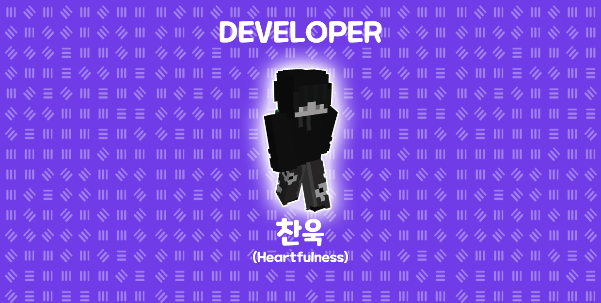

# 🛠 서버 관리자


* 고냥이타운 관리자들을 소개해드립니다.
* 관리자들의 개인 DM으로 문의는 자제 해주시길 바랍니다.


<figure><figcaption></figcaption></figure>

* **고냥**\
  \- 서버의 규칙을 재정하고 수정하며, 관리진들을 통솔합니다.\
  \- 서버의 전반적인 개발 및 지휘를 총괄합니다.\
  \- 고냥이타운의 후원 시스템을 담당하고 있습니다.
* **라드나**\
  \- 고냥님을 도와주는 역할을 합니다.\
  \- 역할 분담 및 서버 컴퓨터 on/off를 담당하고 있습니다.\
  \- 고냥님의 부재 시 고냥님을 대신하여 활동합니다.\
  \- 고냥이타운의 건축가이며, 서버의 컨텐츠 맵과 이벤트 맵을 제작합니다.

<figure><figcaption></figcaption></figure>

* **헤레아**\
  \- 고냥이타운의 전반적인 컨텐츠 기획을 담당하고 있습니다.
* **클레드**\
  \- 고냥이타운의 컨텐츠 기획과 밸런스를 담당하고 있습니다.\
  \- 서버 아이템의 밸런스와 아이템의 기획, 수정을 담당하고 있습니다.
* **강밤도**\
  \- 고냥이타운의 퀘스트 기획과 제작을 담당하고 있습니다.\
  \- 고냥이타운의 홈페이지 제작과 웹디자인을 담당하고 있습니다.

<figure><figcaption></figcaption></figure>

* **니카, 쥬개미**\
  \- 서버 유저 관리를 담당하고 있습니다.\
  \- 서버 신고하기에 대한 내용을 담당하고 있습니다.\
  \- 서버에서 일어나는 문제를 해결하는 일을 담당하고 있습니다.

<figure><figcaption></figcaption></figure>

* **솜뭉치, 헤이디, 낑깡, 힐링**\
  \- 고냥이타운 서버의 채팅 관리를 담당하고 있습니다.\
  \- 고냥이타운 디스코드의 채팅 관리를 담당하고 있습니다.

<figure><figcaption></figcaption></figure>

* **찬욱**\
  \- 서버 내 필요한 플러그인, 스크립트를 제작하며 고냥이타운의 시스템을 담당하고 있습니다.

<figure><figcaption></figcaption></figure>

* **파우**\
  \- 서버 3D 리소스팩을 제작하며 GUI를 담당하고 있습니다.
* **레냥**\
  \- 웹디자인과 서버의 일러스트, 서버의 아이템 리소스팩을 담당하고 있습니다.
