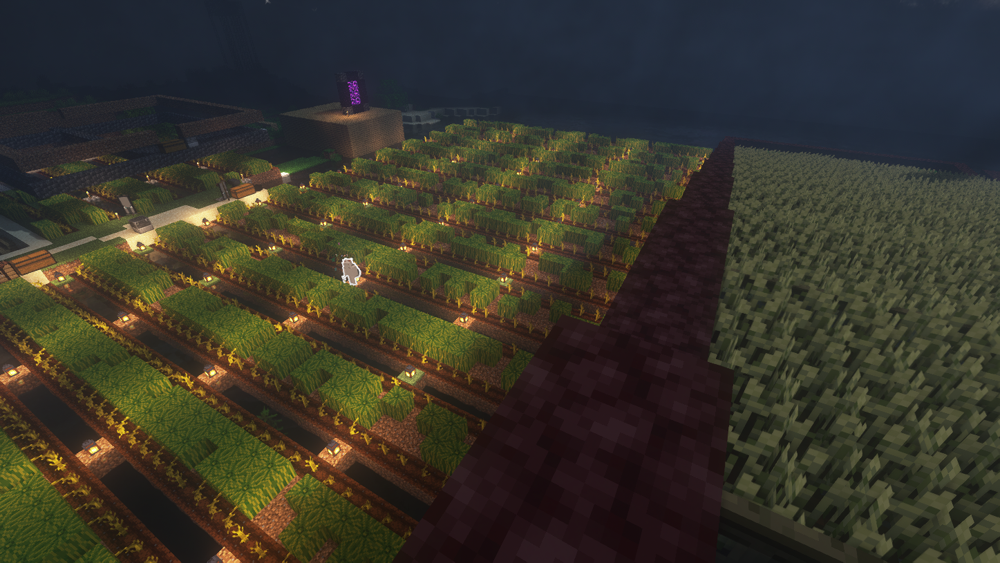
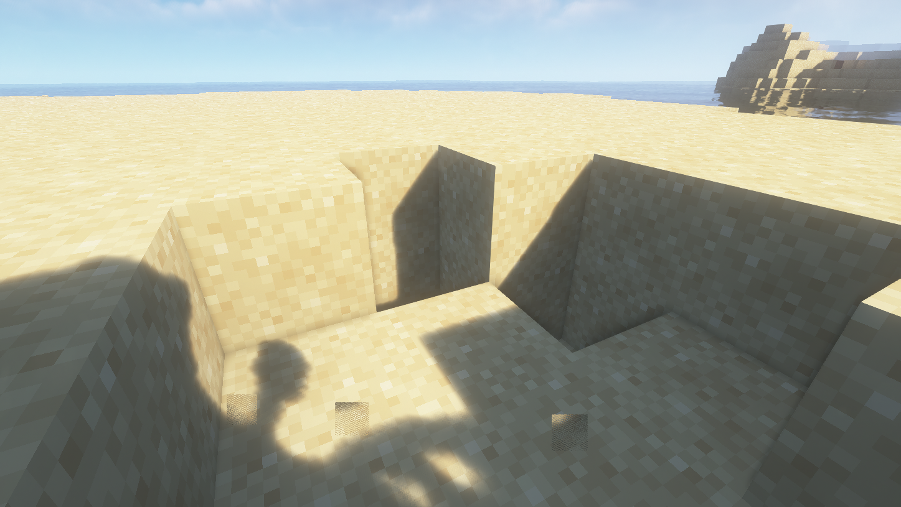

# ⚔️ 스킬 (MCMMO)


<mark style="color:blue;">**야생월드와 마을월드 파티는 연동이 되지않으며,**</mark> <mark style="color:orange;">**야생월드에서 파티경험치 공유 시**</mark>** 야생월드에서 **<mark style="color:orange;">**한번 더 파티를 초대**</mark>**하셔야 합니다.**



<mark style="color:green;">**커스텀 뉴작물**</mark>**과 **<mark style="color:blue;">**커스텀 낚시**</mark>**는 **<mark style="color:purple;">**파티 경험치**</mark>**가 **<mark style="color:red;">**오르지 않습니다!**</mark>


<figure><figcaption></figcaption></figure>

MCMMO의 **총 스킬 갯수는 15개**이며, 각각 **수집 / 전투 / 기타**로 나뉘어집니다.

* 수집(5): **채광, 벌목, 약초학, 낚시, 발굴**
* 전투(5): **비무장, 궁술, 검술, 부술, 조련**
* 기타(5): **곡예, 연금술, 수리, 회수, 제련**

1. **수집 스킬**



<figure><figcaption></figcaption></figure>

채광이란 무엇인가요?

* 돌, 암석, 광물 채광에 중점을 둔 기술이며, 채광 레벨이 올라갈수록 광물의 드롭률 및 스킬 지속시간이 증가합니다.

> 주로 사용하는 아이템은 무엇인가요?

* ⛏️ 곡괭이

> 사용할 수 있는 스킬에 대해 알려주세요!

파괴자

* **종류:** <mark style="color:red;">액티브 스킬(레벨당 0.1% 증가, 최대 100%)</mark>
* **발동 조건:** 곡괭이를 든 상태로 우클릭 후, 좌클릭으로 광물을 캘 시 발동합니다.
* **설명**: 파괴자는 일시적으로 곡괭이에 효율 레벨을 5 증가시키고 광물의 드롭율을 3배로 증가시킵니다. 파괴자는 행운 인첸트와 중첩되지만, 더블 드롭 (드롭 2배)와는 중첩되지 않습니다.

\-----------------------------------------------------------------------------------------------

더블 드롭 (드롭 2배 )

* **종류:** <mark style="color:blue;">패시브 스킬 (LV.50, 10 레벨 당 확률+1.0%)</mark>
* **발동 조건:** 플레이어가 채광을 할 때, 일정확률로 발동합니다.
* **설명**: 레벨에 따라 일정 확률로 자연적으로 생성된 광물을 파괴할시 광물이 2배로 나옵니다.



<figure><figcaption></figcaption></figure>

벌목이란 무엇인가요?

* 벌목이란 도끼로 나무를 베는 것을 기본으로 하는 기술입니다. 벌목 레벨이 오르면 나무가 나올 확률이 증가하며, 스킬 나무꾼의 지속시간이 증가합니다.

> 주로 사용하는 아이템은 무엇인가요?

* 🪓 도끼

> 사용할 수 있는 스킬에 대해 알려주세요!

나무꾼

* **종류:** <mark style="color:red;">액티브 스킬 (LV.50, 5레벨마다 1초씩 증가, 최대 22초)</mark>
* **발동 조건:** 도끼를 든 상태로 우클릭 후, 좌클릭으로 나무를 캘 시 발동합니다.
* **설명**: 나무꾼을 킨 상태로 나무를 캘 시, 도끼의 내구도를 사용하여 자연적으로 생성되거나 재배된 나무를 한번에 캘 수 있습니다.

\-----------------------------------------------------------------------------------------------

나뭇잎 청소

* **종류:** <mark style="color:blue;">패시브 스킬 (LV.150)</mark>
* **발동 조건:** 플래이어가 도끼로 나뭇잎을 캘 시 자동으로 발동합니다.
* **설명**: 플래이어가 도끼로 나뭇잎을 캘 시 나뭇잎이 자동으로 사라집니다.

\-----------------------------------------------------------------------------------------------

하비스트 럼버 (드롭 2배)

* **종류:** <mark style="color:blue;">패시브 스킬 (레벨당 0.1%씩 증가, 최대 100%)</mark>
* **발동 조건:** 플레이어가 벌목를 할때, 일정확률로 발동합니다.
* **설명**: 레벨에 따라 일정 확률로 자연적으로 생성되나 재배된 나무를 파괴할시 나무가 2배로 나옵니다.



<figure><figcaption></figcaption></figure>

약초학이란 무엇가요?

* 약초학이란 식물을 캤을 때 올라가는 스킬입니다. 약초학 레벨이 올라간다면 농사를 할 때 필요한 시간과 재화가 대폭 줄어듭니다.
* 뉴작물, 작물 등을 괭이나손으로 캘시 경험치가 올라갑니다.

> 주로 사용하는 아이템은 무엇인가요?

* 🧑‍🌾 괭이

> 사용할 수 있는 스킬에 대해 알려주세요!

재배의 대지(Green Terra)

* **종류:** <mark style="color:red;">액티브 스킬 (LV.50)</mark>
* **작동방법:** 괭이를 든 상태에서 우클릭
* **설명**: 일시적으로 작물의 드랍률을 3배로 증가시키며, 100% 확률로 씨앗이 자동으로 다시 심어집니다.
* 활성화 중, 밀 씨앗을 이용하여 조약돌->이끼낀 조약돌, 돌벽돌 ->이끼낀 돌벽돌, 흙->잔디로 바꿀 수 있습니다.

\-----------------------------------------------------------------------------------------------

버섯재배자의 숨결(Shroom Thumb)

* **종류:** <mark style="color:red;">액티브 스킬</mark>
* **작동방법:** 붉은버섯과 갈색버섯이 인벤에 있는 상태로 흙블록을 우클릭
* **설명**: 붉은 버섯과 갈색버섯을 소모하여 약초학 레벨에 따라 흙블록을 균사체로 바꾼다.

\-----------------------------------------------------------------------------------------------

더블 드롭(Double Drops)

* **종류:** <mark style="color:blue;">패시브 스킬 (레벨당 0.1% 증가, 최대 100%)</mark>
* **작동방법:** 플레이어가 식물과 작물을 때, 일정확률로 작동합니다.
* **설명**: 레벨에 따라 일정 확률로 모두 자란 작물을 재배할 시 작물 2배로 나옵니다.

\-----------------------------------------------------------------------------------------------

농부의 다이어트(farmer's Diet)

* **종류:** <mark style="color:blue;">패시브 스킬 (바닐라 음식 배고픔 보너스 0\~2.5)</mark>
* **작동방법:** 플래이어가 빵과 같은 재배된 음식을 먹을 때 자동으로 작동합니다.
* **설명**: 레벨에 따라 빵과 같은 재배된 음식으로 회복하는 배고픔의 양을 증가시킵니다.

\-----------------------------------------------------------------------------------------------

재배의 재능(Green Thumb)

* **종류:** <mark style="color:blue;">패시브 스킬 (레벨당 0.1% 증가)</mark>
* **작동방법:** 밀, 비트, 네더와트 등을 수확할 때 자동로 작동합니다.
* **설명**: 레벨에 따라 일정 확률로 씨앗이 자동으로 다시 심어집니다.

\-----------------------------------------------------------------------------------------------

하이랄의 행운(Hylian Luck)

* **종류:** <mark style="color:blue;">패시브 스킬 (레벨당 0.1% 증가, 최대 100%)</mark>
* **작동방법:** 풀, 묘목, 꽃, 죽은덤불을 검으로 부술 시 일정확률로 작동합니다.
* **설명**: 레벨에 따라 일정 확률로 자연적으로 생산된 특정 블록을 검으로 부술 시 아이템을 얻을 수 있습니다.



<figure><figcaption></figcaption></figure>

낚시란 무엇인가요?

* 낚시란 물고기가 찌를 무는 속도를 줄여주고, 유용한 전리품을 끌어올릴 기회를 늘립니다. 또한 몬스터를 죽일 필요없이 전리품을 얻을 수 있도록 합니다.
* 커스텀 물고기와 보물을 낚을 시 경험치가 올라갑니다.

> 주로 사용하는 아이템은 무엇인가요?

* 🎣 낚싯대

> 사용할 수 있는 스킬에 대해 알려주세요!

낚시꾼 장인 (Master Angler)

* **종류:** <mark style="color:blue;">패시브 스킬 (LV.125)</mark>
* **작동 방법:** 플레이어가 낚시를 할 때, 작동합니다.
* **설명**: 레벨에 따라 강이나 바다 바이옴에 있을 때, 보트에 탑승했을 때, 비가 올 때, **물고기가 찌를 무는 속도를 줄여줍니다.**

\-----------------------------------------------------------------------------------------------

흔들기 (Shake)

* **종류:** <mark style="color:blue;">패시브 스킬 (0\~75%)</mark>
* **작동 방법:** 몹이나 동물들에게 낚시찌를 던졌을 경우 자동으로 작동합니다.
* **설명**: 몹을 죽이지 않고도 해당 몹의 전리품 중 하나를 일정확률로 드랍합니다.

\-----------------------------------------------------------------------------------------------

어부의 다이어트 (Fisherman's Diet)

* **종류:** <mark style="color:blue;">패시브 스킬 (보너스 배고픔 획득량 0\~2.5칸)</mark>
* **작동 방법:** 바닐라 생선류의 음식을 먹을 때 자동으로 작동합니다.
* **설명**: 레벨에 따라 생선류의 음식을 먹을 때 회복하는 배고픔의 양을 증가 시킵니다.

\-----------------------------------------------------------------------------------------------

보물 찾기 (**Treasure Hunting)**

* **종류:** <mark style="color:blue;">패시브 스킬 (1\~8단계 계급, 높을수록 네더라이트 등 보물 등급 아이템 확률 증가 )</mark>
* **작동방법:** 플레이어가 낚시를 할때, 자동적으로 작동합니다.
* **설명**: 레벨에 따라 보물을 얻을 확률을 높여줍니다.

<figure><figcaption></figcaption></figure>

<figure><figcaption>
참고) <a href="https://mcmmo.fandom.com/wiki/Fishing">https://mcmmo.fandom.com/wiki/Fishing</a>
</figcaption></figure>

\-----------------------------------------------------------------------------------------------

매직 헌터 (**Magic Hunter)**

* **종류:** <mark style="color:blue;">패시브 스킬 (1\~8단계 계급, 높을수록 높은 인첸트 단계가 붙을 확률 증가 )</mark>
* **작동방법:** 플레이어가 낚시를 할때, 자동적으로 작동합니다.
* **설명**: 보물찾기에서 얻은 방어구, 도구 등의 아이템에 마법을 부여할 수 있는 능력입니다. 낮은 확률로 마인크래프트에서 등장하지 않는 인첸트 조합 아이템(보호, 화염보호 중첩등) 이 나오기도 합니다.



<figure><figcaption></figcaption></figure>

발굴이란 무엇인가요?

* 발굴이란 소울 샌드와 같은 특이한 재료를 포함하여 토양에 있는 모든 것을 파내기 위해, 삽을 사용하는 능력입니다.

> 주로 사용하는 아이템은 무엇인가요?

* 🔨 삽

> 사용할 수 있는 스킬에 대해 알려주세요!

기가 드릴 브레이커 (Giga Drill Breaker)

* **종류:** <mark style="color:red;">액티브 스킬</mark>
* **작동방법:** 삽을 든 상태에서 우클릭
* **설명**: 기가 드릴 브레이커는 일시적으로 삽에 효율레벨을 5씩 증가시킵니다.

\-----------------------------------------------------------------------------------------------

고고학 (Archaeology )

* **종류:** <mark style="color:blue;">패시브 스킬</mark>
* **작동방법:** 플레이어가 삽으로 관련 블럭을 부수고 있을 때, 자동으로 작동합니다.
* 설명: 플레이어가 삽으로 관련 블럭을 부수고 있을 때, 4%에 확률로 2의 경험치를 획득합니

\-----------------------------------------------------------------------------------------------

트레져 헌터 (Treasure Hunt)

* **종류:** <mark style="color:blue;">패시브 스킬</mark>
* **작동방법 :** 플레이어가 삽으로 관련 블럭을 부수고 있을 때, 일정 확률로 작동합니다.

<figure><figcaption>
참고) <a href="https://mcmmo.fandom.com/wiki/Excavation">https://mcmmo.fandom.com/wiki/Excavation</a>
</figcaption></figure>



2. **전투 스킬**



> 궁술이란 무엇인가요?

* 궁술이란 활과 화살을 이용하여 상대에게 데미지를 주는 스킬입니다.

> 주로 사용하는 아이템은 무엇인가요?

* 🏹 활

> 사용할 수 있는 스킬에 대해 알려주세요!

쏘기 솜씨 (Skill Shot)

* **종류:** <mark style="color:blue;">패시브 스킬</mark>
* **작동 방법:** 활과 화살로 적을 공격 시, 작동합니다.
* **설명**: 레벨에 따라 활 데미지가 증가합니다.

\-----------------------------------------------------------------------------------------------

화살 회수 (Arrow Retrieval)

* **종류:** <mark style="color:blue;">패시브 스킬</mark>
* **작동 방법:** 활과 화살 적을 죽였을 때 일정 확률로 작동합니다.
* **설명**: 레벨에 따라 활과 화살 적을 죽였을 때 일정 확률로 화살을 회수할 수 있게 됩니다.

\-----------------------------------------------------------------------------------------------

현혹 (Daze)

* **종류:** <mark style="color:blue;">패시브 스킬</mark>
* **작동 방법:** 활과 화살로 적을 공격할 때 일정확률로 작동합니다.
* **설명**: 레벨에 따라 상대를 맞추었을 때 일정 확률로 강제로 상대방이 하늘을 보게 만듭니다. 이 스킬은 플레이어에게만 적용됩니다.



> 부술이란 무엇인가요?

* 부술이란 도끼 이용하여 상대에게 데미지를 주는 스킬입니다.

> 주로 사용하는 아이템은 무엇인가요?

* 🪓 도끼

> 사용할 수 있는 스킬에 대해 알려주세요!

갑옷 충격 (Impact)

* **종류:** <mark style="color:blue;">패시브 스킬</mark>
* **작동방법:** 도끼로 적을 공격할 때 일정확률로 작동합니다.
* 매우 낮은 확률로 적의 방어구를 파괴합니다.

\-----------------------------------------------------------------------------------------------

도끼 마스터리 (Axe Mastery)

* **종류:** <mark style="color:blue;">패시브 스킬</mark>
* **작동방법:** 도끼로 적을 공격할 때 자동으로 작동합니다.
* **설명**: 레벨에 따라 도끼 데미지가 증가합니다.

\----------------------------------------------------------------------------------------------

\*\*\*\* 크리티컬 스트라이크 (Critical Strike)

* **종류:** <mark style="color:blue;">패시브 스킬</mark>
* **작동방법:** 도끼로 적을 공격할 때 일정확률로 작동합니다.
* **설명**: 레벨에 따라 도끼로 적을 공격할 때 크리티컬이 적용됩니다. 크리티컬이 적용되면 플래이어에게는 1.5배, 몹에게는 2배의 데미지를 줍니다.

\-----------------------------------------------------------------------------------------------

엄청난 충격 (Greater Impact)

* **종류:** <mark style="color:blue;">패시브 스킬</mark>
* **작동방법:** 도끼로 비무장 상태의 적을 공격할 때 일정확률로 작동합니다.
* **설명**: 25%의 확률로 비무장 상태의 적에게 더 큰 데미지를 줍니다

\-----------------------------------------------------------------------------------------------

Skull Splitter (뼈 쪼개기)

* **종류:** <mark style="color:red;">엑티브 스킬</mark>
* **작동방법:** 도끼를 든 상태에서 우클릭
* **설명**: 작동 시 도끼로 적을 공격할 시 주위에 적에게도 50%의 광역피를 주며, 레벨에 따라 도끼 데미지가 증가합니다



> 검술이란 무엇인가요?

* 검술이란 검을 이용하여 상대에게 데미지를 주는 스킬입니다.

> 주로 사용하는 아이템은 무엇인가요?

* ⚔️ 검

> 사용할 수 있는 스킬에 대해 알려주세요!

카운터 어택 (Counter Attack)

* **종류:** <mark style="color:blue;">패시브 스킬</mark>
* **작동방법:** 적에게 근거리 공격을 당했을 때 일정확률로 작동합니다.
* **설명**: 레벨에 따라 적에게 공격을 당했을 때 그 절반 데미지를 적에게 돌려줍니다.

\-----------------------------------------------------------------------------------------------Rupture

* **종류:** <mark style="color:blue;">패시브 스킬</mark>
* **작동방법:** 적을 검으로 공격했을 때 일정확률로 작동합니다.
* **설명**: 레벨에 따라 6초동안 1데미지(하트 반칸)를 줍니다.

\-----------------------------------------------------------------------------------------------

톱날 공격 (Serrated Strikes)

* **종류:** <mark style="color:red;">액티브 스킬</mark>
* **작동방법:** 검을 들고 우클릭 후 공격
* **설명**: 스킬 레벨에 비례한 지속시간동안 검의 데미지가 증가하고 확률적으로 출혈효과를 입힙니다.

\-----------------------------------------------------------------------------------------------

출혈 (Bleed)

* **종류:** <mark style="color:orange;">하위 스킬</mark>
* **작동방법:** 상위스킬에 의해서 작동
* **설명**: 10초동안 1데미지(하트 반칸)를 줍니다. 출혈은 중첩되지 않습니다.



> 조련이란 무엇인가요?

* 조련이란 늑대의 전투를 보조하는 스킬입니다.

> 주로 사용하는 동물은 무엇인가요?

* **🐺늑대** 🐴말 😺고양이

> 사용할 수 있는 스킬에 대해 알려주세요!

짐승의 포효 (Beast Lore)🐺😺

* **종류:** <mark style="color:blue;">패시브 스킬</mark>
* **작동방법:** 늑대에게는 뼈를, 고양이에게는 생선을 들고 좌클릭 시 자동으로 작동합니다.
* **설명**: 늑대와 고양이의 남은 체력을 확인할 수 있습니다.

\-----------------------------------------------------------------------------------------------

짐승의 포효 (Call of the Wild)🐺🐴😺

* **종류:** <mark style="color:red;">엑티브 스킬</mark>
* **작동방법:** 웅크린 상태로 뼈, 생선, 사과를 들고 좌클릭 합니다.
* **설명**: 웅크린 상태로 뼈를 들고 좌클릭 시 늑대를 생선을 들고 좌클릭 시 고양이를, 사과를 들고 좌클릭 시 말을 소환합니다. 각각의 재료는 10개를 소모합니다. 소환된 동물은 일정 시간이 지나면 사라집니다.

\-----------------------------------------------------------------------------------------------

Gore (그르렁거림)🐺

* **종류:** <mark style="color:blue;">패시브 스킬</mark>
* **작동방법:** 늑대가 적을 공격할 때 일정확률로 작동합니다.
* **설명**: 레벨에 따라 늑대가 적을 공격할 때 출혈 상태에 빠지게 합니다.

\-----------------------------------------------------------------------------------------------

Bleed (출혈)

* **종류:** <mark style="color:orange;">하위 스킬</mark>
* **작동방법:** 상위스킬에 의해서 작동
* **설명**: 10초동안 1데미지(하트 반칸)를 줍니다. 출혈은 중첩되지 않습니다.

\-----------------------------------------------------------------------------------------------

Fast Food Service (빠른 음식 서비스)🐺

* **종류:** <mark style="color:blue;">패시브 스킬</mark>
* **작동방법:** 늑대가 적을 공격할 때 일정확률로 작동합니다.
* **설명**: 늑대가 적을 공격할 때 50% 확률 늑대의 체력이 회복됩니다.

\-----------------------------------------------------------------------------------------------

Environmentally Aware (주변 환경 의식)🐺

* **종류:** <mark style="color:blue;">패시브 스킬</mark>
* **작동방법:** 늑대가 자연에 의해서 데미지를 입을 때 자동으로 작동합니다.
* **설명**: 늑대가 자연에 의해서 데미지를 입지 않습니다. 즉 높은 곳에서 떨어지거나, 용암에 잠수해도 멀쩡합니다.

\-----------------------------------------------------------------------------------------------

Thick Fur (두꺼운 모)🐺

* **종류:** <mark style="color:blue;">패시브 스킬</mark>
* **작동방법:** 늑대가 적에게 공격받을 때 자동으로 작동합니다.
* **설명**: 늑대가 적에게 공격받을 때 그 데미지의 50%만 받습니다. 또한 화염저항이 생깁니다.

\-----------------------------------------------------------------------------------------------

Shock Proof (충격의 증거)🐺

* **종류:** <mark style="color:blue;">패시브 스킬</mark>
* **작동방법:** 늑대가 폭팔 데미지를 입었을 때 자동으로 작동합니다.
* **설명**: 늑대가 폭팔 데미지를 입었을 때, 그 데미지의 1/6만 받습니다.

\-----------------------------------------------------------------------------------------------

Sharpened Claws (날카로워진 발톱들)🐺

* **종류:** <mark style="color:blue;">패시브 스킬</mark>
* **작동방법:** 늑대가 적을 공격할 때 자동으로 작동합니다.
* **설명**: 늑대의 공격력을 4만큼(하트 2칸) 올립니다.



> 비무장이란 무엇인가요?

* 비무장이란 맨손을 이용하여 상대에게 데미지를 주는 스킬입니다.

> 주로 사용하는 아이템은 무엇인가요?

* 🫱맨손

> 사용할 수 있는 스킬에 대해 알려주세요!

화살 회피 (Arrow Deflect)

* **종류:** <mark style="color:blue;">패시브 스킬</mark>
* **작동방법:** 화살을 맞을 시 일정 확률로 작동합니다.
* **설명**: 화살을 맞을 시 레벨에 따라 일정 확률로 화살 데미지를 무시합니다.

\-----------------------------------------------------------------------------------------------

버서 (Berserker)

* **종류:** <mark style="color:red;">엑티브 스킬</mark>
* **작동방법:** 맨손 상태로 우클릭
* **설명**: 비무장 상태의 공격력을 50% 증가.

\-----------------------------------------------------------------------------------------------

Block Cracker

* **종류:** <mark style="color:blue;">패시브 스킬</mark>
* **작동방법:** 버서커 상태에서 석재벽돌, 유리 등을 클릭할 시 자동으로 작동한다.
* **설명**: '석재벽돌'을 '깨진 석재벽돌'로 바꾸는 등 특정 블록을 깨뜨린다.

\-----------------------------------------------------------------------------------------------

비무장 (Disarm)

* **종류:** <mark style="color:blue;">패시브 스킬</mark>
* **작동방법:** 플래이어를 맨손으로 때릴 때 일정 확률로 작동한다.
* **설명**: 레벨에 따라 일정 확률로 상대가 들고 있는 아이템을 떨어뜨린다.

\-----------------------------------------------------------------------------------------------

Steel Arm Style

* **종류:** <mark style="color:blue;">패시브 스킬</mark>
* **작동방법:** 플래이어를 맨손으로 때릴 때 자동로 작동한다.
* **설명**: 플래이어를 맨손으로 때릴 때 레벨에 따라 데미지가 증가합니다.

\-----------------------------------------------------------------------------------------------

아이언 그립 (Iron Grip)

* **종류:** <mark style="color:blue;">패시브 스킬</mark>
* **작동방법:** 적이 비무장을 발동될 때 자동으로 작동합니다.
* **설명**: 비무장 스킬을 발동했을 때 일정 확률로 스킬을 실패하게 합니다



3. **기타 스킬**



> 곡예란 무엇인가요?

* 곡예란 '우아한 구르기'과 패시브 스킬 '회피'로 전투 데미지 무효화를 가능하게 하는 스킬입니다.

> 어떻게 사용할 수 있을까요?

* 🧑‍🤝‍🧑플레이어 캐릭터 (자기 자신)

> 사용할 수 있는 스킬에 대해 알려주세요!

회피 (Dodge)

* **종류:** <mark style="color:blue;">패시브 스킬</mark>
* **작동방법:** 원거리 공격을 받으면 일정확률로 작동합니다.
* **설명**: 원거리 공격의 데미지를 절반만 받습니다.

\-----------------------------------------------------------------------------------------------

구르기 (Roll)

* **종류:** <mark style="color:blue;">패시브 스킬</mark>
* **작동방법:** 높은 곳에서 떨어질 때 일정확률로 작동합니다.
* **설명**: 떨어질 때 낙하 데미지를 5만큼(하트 2칸 반) 줄여줍니다.

\-----------------------------------------------------------------------------------------------

우아한 구르기 (Graceful Roll)

* **종류:** <mark style="color:red;">액티브 스킬</mark>
* **작동방법:** 높은 곳에서 떨어질 때 웅크리기 시 일정확률로 작동
* **설명**: 레벨에 따라 낙하 데미지를 10만큼(하트 5칸) 줄여줍니다.



> 연금술이란 무엇인가요?

* 연금술이란 다양한 표션을 양조하는 스킬입니다.

> 주로 사용하는 아이템은 무엇인가요?

* 💊양조기

> 사용할 수 있는 스킬에 대해 알려주세요!

촉매 (Catalysis)

* **종류:** <mark style="color:blue;">패시브 스킬</mark>
* **작동방법:** 표션을 재조할 때 자동으로 작동합니다.
* **설명**: 레벨에 따라 표션을 양조하는 속도가 빨라진다.

\-----------------------------------------------------------------------------------------------

혼합 (Concoctions)

* **종류:** <mark style="color:blue;">패시브 스킬</mark>
* **작동 방법:** 포션을 제조할 때 자동으로 작동합니다.
* **설명**: 레벨에 따라 제조할 수 없는 포션을 제조할 수 있게 됩니다.\
  모든 커스텀 포션은 어색한 물약을 거쳐 만들 수 있습니다.

|                                                                                                                                                                                                                                                             |        물약 이름        |        물약 효과       |   재료   |  레벨  |  유형 |                정보                |
| :---------------------------------------------------------------------------------------------------------------------------------------------------------------------------------------------------------------------------------------------------------: | :-----------------: | :----------------: | :----: | :--: | :-: | :------------------------------: |
|                                                                                                                                                                              |       성급함의 물약       |         성급함        |   당근   |  100 |  버프 |             채굴 속도 증가             |
|                                                                                                     .webp>)                                                                                                     | 
흡수의

물약
 |         흡수         |  네더 석영 |  200 |  버프 |  피해를 입으면 사라지는 2개의 추가 채력을 적용합니다.  |
|  |       채굴피로 물약       | 
채굴

피로
 |  슬라임볼  |  200 | 디버프 |             채광 피로 적용             |
|                                                                                                                                                                                                       |       채력증가 물약       | 
채력

증가
 |   사과   |  350 |  버프 |       레벨당 2개의 충전 가능한 채력 적용       |
|                                                                                                                                                                                                                    |       굶주림의 물약       |         굶주림        |  썩은 살점 |  350 | 디버프 |      더 빠른 속도로 배고픔 을 고갈시킵니다.      |
|                                                                                                                                                                                                                    |       메스꺼움 물약       |        메스꺼움        |  갈색 버섯 |  500 | 디버프 | 시야를 소용돌이 치게 합니다(네더 포털에 들어가는 것처럼) |
|                                                                                                                                                                          |        실명의 물약       |         실명         | 먹물 주머니 |  500 | 디버프 |           시야를 감소 시킵니다.           |
|  |        포화의 물약       |         포화         |   고사리  |  750 |  버프 |      음식을 먹지 않고도 배고픔이 증가합니다.      |
|                                                                                                                                                                                                                    |        시듦의 물약       |         시듦         |   독감자  |  900 | 디버프 |  화상이나 독과 같이 시간이 지남에 따라 피해를 받습니다. |
|                                                                                                                                                                                                                |        저항의 물약       |         저항         |  황금 사과 | 1000 |  버프 |         레벨 당 20% 피해 감소 적용        |



> 수리란 무엇인가요?

* 수리란 철블록을 통하여 내구도가 손상된 아이템을 수리하는 스킬입니다.
* 철블록을 놓고, 우클릭하여 재료를 소모하고 수리할 수 있습니다.

> 주로 사용하는 아이템은 무엇인가요?

* 👨‍🔧 철 블록

> 사용할 수 있는 스킬에 대해 알려주세요!

인첸트 아이템 수리 (Arcane Forging)

* **종류:** <mark style="color:blue;">패시브 스킬 (레벨당 수리 품목 다름)</mark>
* **작동방법:** 철블럭으로 수리를 할 때 자동으로 작동합니다.
* **설명**: 수리 시 인첸트가 유지됩니다.

\----------------------------------------------------------------------------------------------

수리 마스터리(Repair Mastery)

* **종류:** <mark style="color:blue;">패시브 스킬 (레벨당 수리 품목 다름)</mark>
* **작동방법:** 내구도가 손장된 아이템을 들고 철블럭에 우클릭
* **설명**: 해당 도구의 주요 재료를 소모하여 손상된 내구도를 복구한다.

\---------------------------------------------------------------------------------------------

슈퍼 수리 (Super repair)

* **종류:** <mark style="color:blue;">패시브 스킬</mark>
* **작동방법:** 철블럭으로 수리를 할 때 자동으로 작동합니다.
* **설명**: 수리를 할 때 레벨에 따라 더 많은 내구도를 복구한다.



> 제련이란 무엇인가요?

* 제련이란 화로를 통하여 광물을 굽는 행위를 보조하는 스킬입니다.

> 주로 사용하는 아이템은 무엇인가요?

* 🔧 화로

> 사용할 수 있는 스킬에 대해 알려주세요!

유동 효율성 (Fuel Efficiency)

* **종류:** <mark style="color:blue;">패시브 스킬</mark>
* **작동방법:** 화로로 연료를 사용할 때 자동으로 작동합니다.
* **설명**: 화로로 연료를 사용할 때 레벨에 따라 연료지속시간을 늘려줍니다.

\-----------------------------------------------------------------------------------------------

두번째 재련 (Second Smelt)

* **종류:** <mark style="color:blue;">패시브 스킬</mark>
* **작동방법:** 화로로 원석을 구울 때 일정 확률로 작동합니다.
* **설명**: 화로로 원석을 구울 때 레벨에 따라 일정 확률로 아이템이 2배로 나옵니다.

\----------------------------------------------------------------------------------------------

Understanding The Art

* <mark style="color:blue;">패시브 스킬</mark>
* 원석을 캘 때, 레벨에 따라 일정 확률로 작동합니다.
* 원석을 캘 때, 레벨에 따라 일정 확률로 주괴 형태로 아이템을 드랍하게 해줍니다.



> 회수란 무엇인가요?

* 회수란 금블록을 통하여 내구도가 충분한 아이템을 분해하는 스킬입니다.

> 주로 사용하는 아이템은 무엇인가요?

* 🔧 금 블록

> 사용할 수 있는 스킬에 대해 알려주세요!

인첸트 아이템 수리 (Arcane Forging)

* **종류:** <mark style="color:blue;">패시브 스킬</mark>
* **작동방법:** 인첸트가 붙은 아이템을 금블록을 통하여 회수할 때 레벨에 따라 일정 확률로 작동한다.
* **설명**: 인첸트가 붙은 아이템을 금블록을 통하여 회수할 때 레벨에 따라 일정 확률로 해당 인첸트들을 추출할 수 있다.


