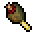
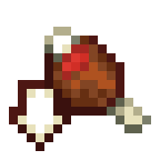

# 💊 연금술

> 연금술이란 무엇인가요?&#x20;

* 연금술이란 다양한 표션을 양조하는 스킬입니다.

> 주로 사용하는 아이템은 무엇인가요?

* 💊양조기

> 사용할 수 있는 스킬에 대해 알려주세요!

Catalysis (촉매)

* **종류:** <mark style="color:blue;">패시브 스킬</mark>
* **작동방법:** 표션을 재조할 때 자동으로 작동합니다.
* **설명**: 레벨에 따라 표션을 양조하는 속도가 빨라진다.

\-----------------------------------------------------------------------------------------------------

Concoctions (혼합)

* **종류:** <mark style="color:blue;">패시브 스킬</mark>
* **작동방법:** 표션을 재조할 때 자동으로 작동합니다.
* **설명**: 레벨에 따라 제조할 수 없는 표션을 재조할 수 있게된다.

|                                                                                                                                                                                                                                                                |         물약 이름        |        물약 효과        |   재료  |  레벨  |  유형 |                정보                |
| :------------------------------------------------------------------------------------------------------------------------------------------------------------------------------------------------------------------------------------------------------------: | :------------------: | :-----------------: | :---: | :--: | :-: | :------------------------------: |
|                                                                                                                                                                              |        성급함의 물약       |         성급함         |   당근  |  100 |  버프 |             채굴 속도 증가             |
|                                                                                                     .webp>)                                                                                                     | 
흡수의 

물약
 |          흡수         | 네더 석영 |  200 |  버프 |  피해를 입으면 사라지는 2개의 추가 채력을 적용합니다.  |
|  |        채굴피로 물약       | 
채굴 

피로
 |  슬라임볼 |  200 | 디버프 |             채광 피로 적용             |
|                                                                                                                                                                                                       |        채력증가 물약       | 
채력 

증가
 |   사과  |  350 |  버프 |       레벨당 2개의 충전 가능한 채력 적용       |
|                                                                                                                                                                                                                    |        굶주림의 물약       |         굶주림         |  썩은 살 |  350 | 디버프 |      더 빠른 속도로 배고픔  을 고갈시킵니다.     |
|                                                                                                                                                                                                                    |        매스꺼움 물약       |         메스꺼움        | 갈색 버섯 |  500 | 디버프 | 시야를 소용돌이 치게 합니다(네더 포털에 들어가는 것처럼) |
|                                                                                                                                                                          |        실명의 물약        |          실명         | 먹물 주머 |  500 | 디버프 |            시야를 감소시킵니다.           |
|  |        포화의 물약        |          포화         |   고사  |  750 |  버프 |      음식을 먹지 않고도 배고픔이 증가합니다.      |
|                                                                                                                                                                                                                    |        시듦의 물약        |          시듦         |  독감자  |  900 | 디버프 |  화상이나 독과 같이 시간이 지남에 따라 피해를 받습니다. |
|                                                                                                                                                                                                                |        저항의 물약        |          저항         | 황금 사과 | 1000 |  버프 |         레벨당 20% 피해 감소 적용         |

