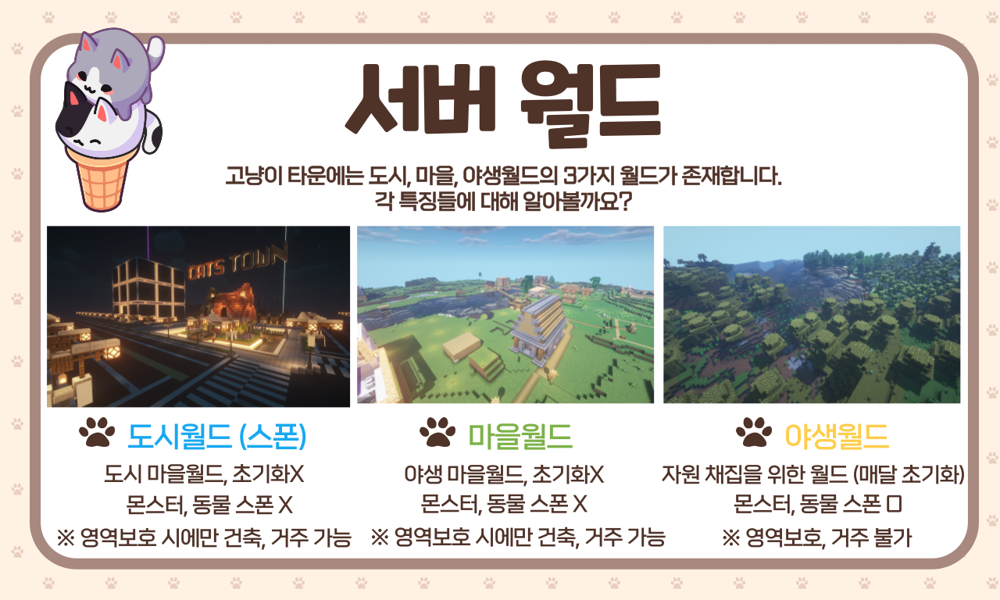
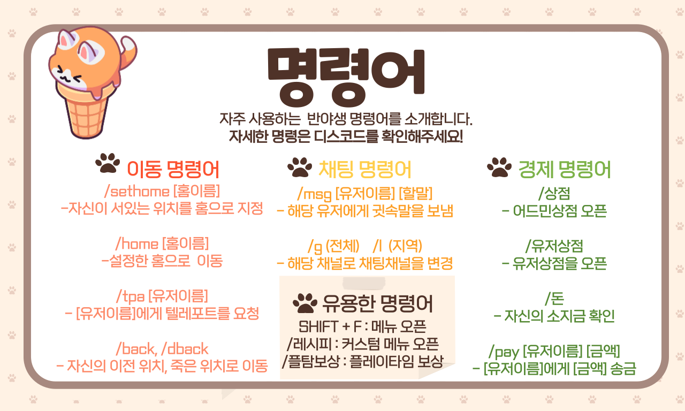
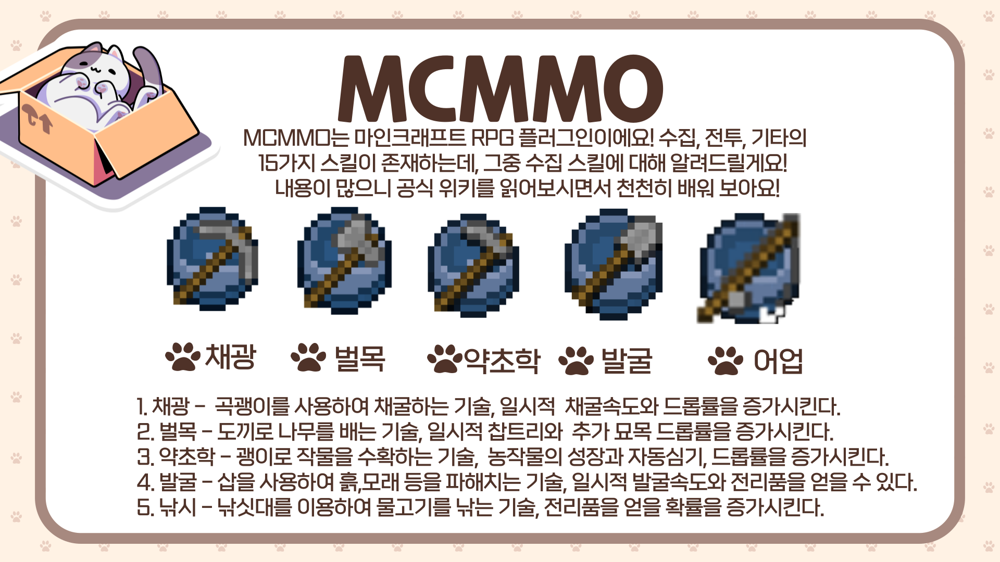

# 🌟 튜토리얼

### ⭐ 서버 특징&#x20;

* 1.19.2 24시간 반야생 정품 서버입니다.&#x20;
* 죽어도 아이템을 잃지 않습니다.
* 부동산 명령어를 통해 자신의 땅을 보호할 수 있습니다.&#x20;
* 폭발/농작물 훼손/플라이 방지가 적용되어 있으며, tnt 등 특정 아이템 금지 및 로그조사가 적용되어 있어 테러 및 핵을 방지하고 있습니다.&#x20;
* 쾌적한 서버를 위해 일정 시간마다 땅에 떨어진 아이템이 초기화되며, 자동줍기가 적용되어 있습니다. (/tt : 쓰레기통)으로 아이템을 버려주세요!
* 인벤세이브, 자동줍기, 시각화토글, 정렬 등의 편의기능이 존재합니다.

### &#x20;🚫 방지 아이템

* TNT, TNT가 실린 광산 수레 (테러방지)
* 리스폰 정박기, 관측기, 발사기 (악용시 위험 아이템)
* 마인카트 (지하철 전용)&#x20;

.png>)


[undefined.md](../undefined/undefined.md)



[undefined](../undefined-4/undefined/)



[undefined-1.md](../undefined-4/undefined-1.md)



[undefined-2.md](../undefined-4/undefined-2.md)



[undefined.md](../tutorial/undefined.md)


.png>)


[undefined.md](../undefined-1/undefined.md)



[mcmmo.md](../mcmmo.md)


.png>)


[undefined-2](../undefined-2/)



[undefined-7](../undefined-2/undefined-7/)

