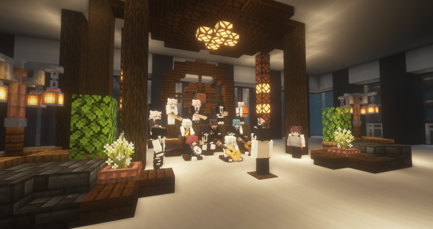

# 🏙️ 신도시

1. **신도시 스폰 근처**&#x20;



<figure><figcaption>
신도시 스폰구역
</figcaption></figure>

* 고냥이 타운의 새로운 2스폰, 신도시 월드를 만나보세요.
* 신도시 스폰은 현실 컨텐츠를 기반으로 한 다양한 스폰의 역할을 수행합니다. (워프존 및 여러 상점가와 시설, 체험형 건축물 등이 있습니다)&#x20;
* 유저상점에 입주하여 사람들에게 가까운 위치에서 물건을 판매하거나 매입할 수 있습니다.
* 신도시 광장에서는 보드게임을 즐길 수 있습니다.\

**신도시 상점 타워**&#x20;

신도시 상점 타워는 서버 메인 상점을 담당하고 있습니다. \
각 1\~3층까지 있으며 다음 상점으로 구분됩니다.

**<1층:  코인 상점, 2층: 페인트 상점, 3층: 악기 상점>**

1. **<상점 1층> 은행 환전소**&#x20;

<figure><figcaption>
은행 환전소
</figcaption></figure>

* 은행 환전소에서는 **작물코인, 고양이 코인**을 환전할 수 있는 **환전소**가 갖추어져 있습니다.

2\. **<상점 1층> 뉴작물 상점**

<figure><figcaption>
뉴작물 상점
</figcaption></figure>

* 뉴작물 상점에서는 다양한 **농작물 씨앗과 농기구**를 구매할 수 있습니다.

3. **<상점 1층> 나무 상점**

<figure><figcaption>
나무 상점
</figcaption></figure>

* 나무 상점에서는 다양한 종류의 **커스텀 나무**를 구매할 수 있습니다.

4. **<상점 2층> 페인트 상점**

<figure><figcaption></figcaption></figure>

* 페인트 상점에서는 다양한 **페인트 도구**를 구매할 수 있습니다.

5. **<상점 3층> 악기 상점**

<figure><figcaption>
3F - 악기 상점
</figcaption></figure>

* 악기상점에서는 **수동악기 및 합주악기**를 판매하고 있습니다.
* 서버 내 악기 시스템을 사용하여 자유롭게 연주해보세요!

****

6. **<상점 1층 외곽> 자동차 판매 상점**

<figure><figcaption></figcaption></figure>

* 자동차 판매원에게 말을 걸면 **자동차**를 구매할 수 있습니다.
* 자동차는 **신도시와 도시월드**에서 사용이 가능합니다.

7. **<스폰 중앙 분수대> 물고기 판매상**

<figure><figcaption>
스폰 중앙 분수대
</figcaption></figure>

* 중앙 분수대에서 **물고기를 매입하는 판매상**에게 말을 걸어 물고기를 판매해보세요!



<figure><figcaption></figcaption></figure>

* 오픈 준비중인 마모의 초밥가게입니다. 추후 다양한 음식을 판매할 예정입니다&#x20;



<figure><figcaption></figcaption></figure>

* 가구상점에서는 다양한 아이템을 전시 및 판매하고 있으며, 각 가구의 획득 방식이 상점에 명시되어 있습니다.&#x20;
* 자세한 가구 목록은[undefined-5](../../.-.-.-.-1/undefined-5/ "mention")를 참고해주세요!




<figure><figcaption></figcaption></figure>

 

<figure><figcaption>
치장 목록
</figcaption></figure>

* 치장 상점에서는 **후원 치장을 구매**할 수 있으며, **옷장에서 치장 등록한 아이템을 착용**하거나 여러 **치장들을 직접 입어볼 수** 있습니다.
* **/warp 치장상점** 이나 **/옷장** 명령어로 이동이 가능합니다.



2. **유저/편의시설**



<figure><figcaption></figcaption></figure>

* 신도시  유저상점은 **설치상점**을 이용하여 자유롭게 입주할 수 있으며,  마을 단위로 **물건을 매입하고 판매할** 수 있습니다.



<figure><figcaption></figcaption></figure>

* 교회 NPC인 수녀에게 말을 걸어, 기부를 하고 **기부랭킹**에 도전해보세요!

ㄴ 기부 랭킹 달성 시, **이달의 상품**을 드립니다.



<figure><figcaption>
미술관 정문
</figcaption></figure>

<figure><figcaption>
2층 공용화실에서 그림을 그리는 모습
</figcaption></figure>

* 미술관은 **/warp** 미술관 명령어로 갈 수 있으며, 서버 내에서 사람들이 그린 다양한 그림을 감상할 수 있습니다.
* <mark style="color:orange;">**디스코드 전시신청 게시판**</mark>에서 **전시 신청**을 할 수 있습니다.
* <mark style="color:orange;">****</mark>[<mark style="color:orange;">**2층 공용화실**</mark>](#user-content-fn-1)[^1]에서 사람들과 모여 그림을 그릴 수 있습니다.



<figure><figcaption></figcaption></figure>

* 박물관은 **/warp 박물관** 명령어로도 이동할 수 있으며, 서버 내에 서식하는 다양한 몬스터를 만나볼 수 있습니다.
* 박물관 1층은 **야생월드에서 등장하는 몹**, 2층은 **야생에서 등장하는 물고기**가 전시되어 있습니다.



[^1]: 미술관 2층에 위치한 공용화실
