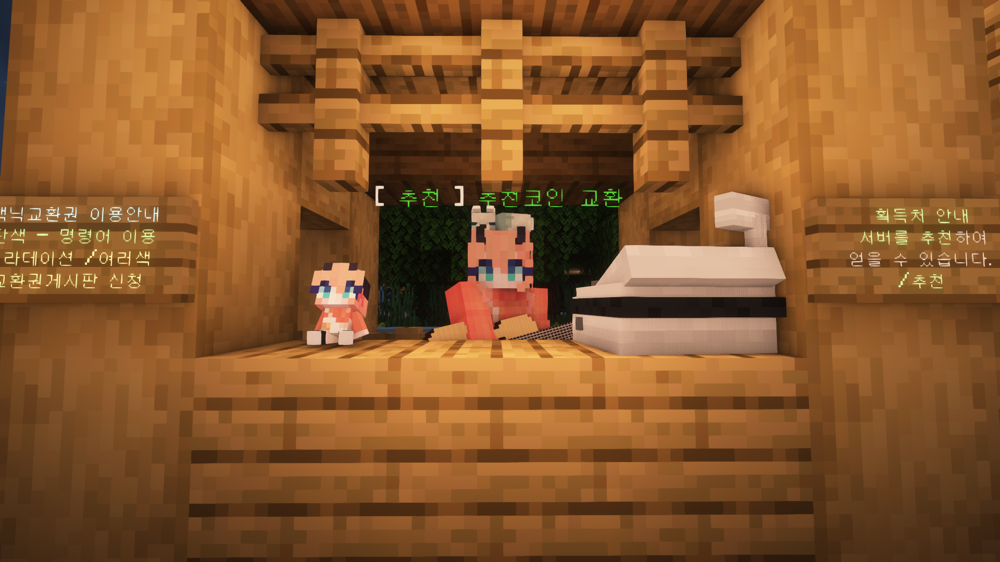
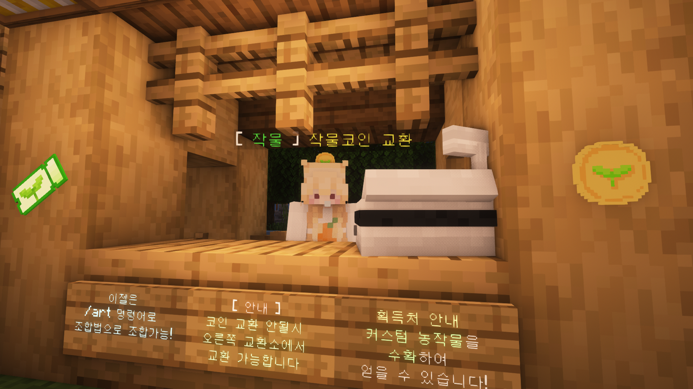
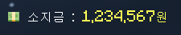
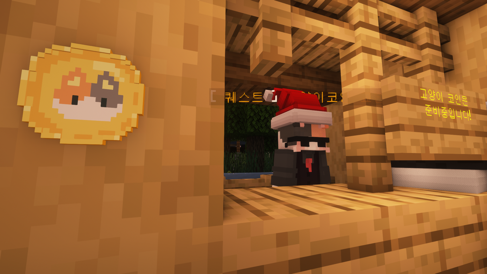
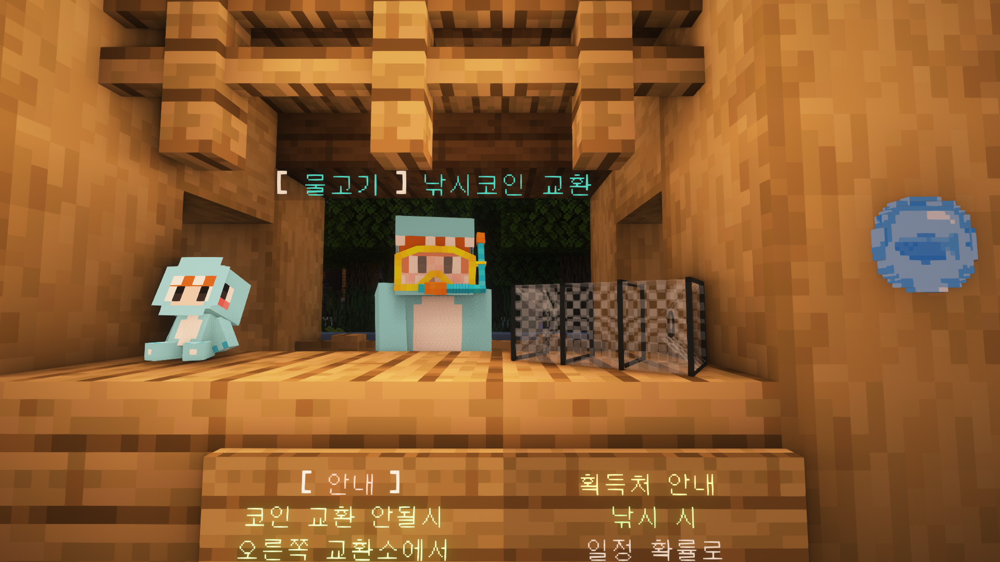

# 🪙 경제

1. 추천코인 (추천)

<figure><figcaption></figcaption></figure>

* 추천을 통해 획득 가능하며, 일부 아이템을 구매할 수 있습니다
* 주로 반야생 컨텐츠의 도움이 되는 용품들을 판매합니다.
* 아이템: 교환권, 철제 가구, 악기, 치장, 가구, 그림도구

2\. 작물코인 (농사 컨텐츠)

<figure><figcaption></figcaption></figure>

* 커스텀 농작물 재배를 통해 획득하는 작물코인은 다양한 아이템을 교환할 수 있습니다
* 작물코인 2세트를 조합하면 작물교환권 1개를 얻을 수 있습니다.
* 아이템: 커스텀 나무, 뉴작물, 빛 블럭, 투명액자

3\. 일반 서버 머니 (경제)

<figure><figcaption></figcaption></figure>

* **/돈** 명령어로 자신의 돈을 확인할 수 있습니다.
* 야생과 퀘스트를 통해 획득 가능하며, **/상점** 및 **/유저상점** 구매에 사용됩니다.
* 서버의 메인이 되는 화폐이며, 대부분의 거래에 활용할 수 있습니다.
* 서버 소지금의 최대 제한금액은 100,000,000원이며, 마을 소지금의 최대 금액도 마찬가지로 100,000,000원으로 제한되어 있습니다.

4\. 고양이 코인 (퀘스트) / 예정

<figure><figcaption></figcaption></figure>

* 퀘스트와 이벤트를 통해 획득 가능하며, 상점에서 치장 및 아이템으로 교환할 수 있습니다

5\. 후원캐쉬 (EULA 준수)

<figure><figcaption></figcaption></figure>

* **/캐시 확인** 명령어로 캐시를 확인할 수 있습니다.
* 캐시는 후원 전용으로 획득이 가능하며, 거래가 불가능합니다.

6\. 낚시코인

<figure><figcaption></figcaption></figure>

* 낚시를 하면 낮은 확률로 획득 가능합니다.
* 낚시 아이템 혹은 치장 아이템으로 교환이 가능합니다.
