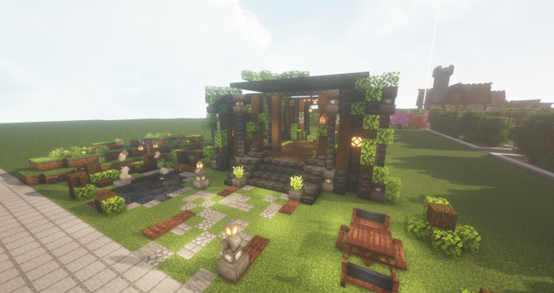

# 🪑 커스텀 가구


**청크당 가구 수 제한 안내**

서버 랙을 방지하고자 청크당 최대 50개의 가구를 배치할 수 있습니다.


<figure><figcaption></figcaption></figure>

<figure><figcaption></figcaption></figure>
