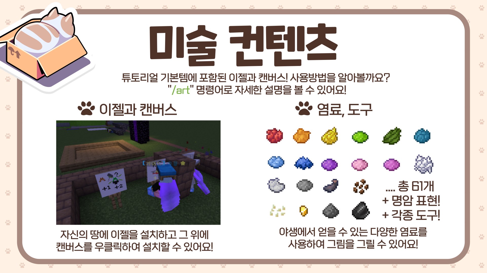

# 🎨 미술

<figure><figcaption>
이젤을 사용하여 캔버스에 그림을 그리는 모습
</figcaption></figure>

* **/art** 명령어를 이용하여 그림 명령어를 확인할 수 있습니다.
* 그림을 그리려면 이젤, 캔버스의 구매가 필요하며, 작물코인, 추천코인으로 구매할 수 있습니다.
* 이젤을 놓고 그 위에 캔버스를 놓아, 캔버스를 우클릭하여 그림을 그릴 수 있습니다.

※ 염료와 도구는 기본으로 제공되며, 이젤을 여러 개 겹쳐 큰 그림을 그릴 수 있습니다.

※ 그림 저장은 이젤에 앉은 상태에서 /art save (작품명) 명령어를 사용하여 저장할 수 있습니다. (저장을 안하면 그림 저장 / 복구가 불가능합니다)

Q. 그림을 어떻게 활용할 수 있을까요?

* 거래 게시판을 통하여 작품을 거래하거나, 유저분들께 커미션을 받는 방법, 미술관을 만들거나 장식으로 사용하는 방법 등이 있습니다.
* \[i] 명령어로 연동채팅에서 그림을 자랑할 수 있습니다.
