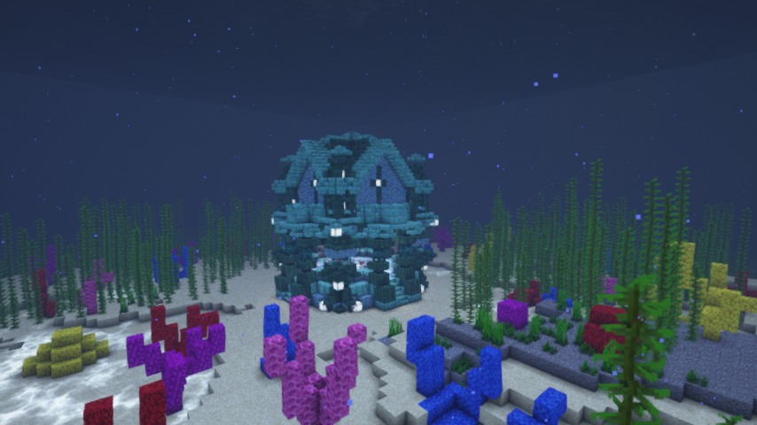
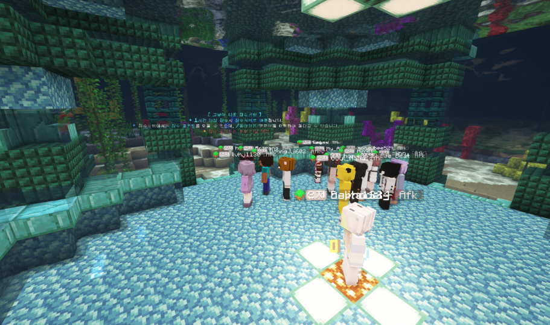

# 🐳 잠수서버

<figure><figcaption></figcaption></figure>

<figure><figcaption></figcaption></figure>


**잠수 포인트 및 잠수서버 이동 명령어 도입은 준비중입니다.**&#x20;


* 잠수서버는 **도시/마을월드 및 야생월드에서 1시간 이상 잠수** 시, 자동으로 이동됩니다.
* ~~잠수서버에서는  **5분 간격으로 잠수포인트를 획득**할 수 있으며, **잠수상점에서 포인트로 아이템을 교환**할 수 있습니다.~~
