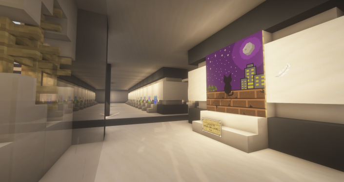

# 🎨 미술관

<figure><figcaption>
미술관 정문
</figcaption></figure>

<figure><figcaption>
2층 공용화실에서 그림을 그리는 모습
</figcaption></figure>

* 미술관은 /warp 미술관 명령어로 갈 수 있으며, 서버 내에서 사람들이 그린 다양한 그림을 감상할 수 있습니다.
* 2층 공용화실에서 사람들과 모여 그림을 그릴 수 있습니다.
