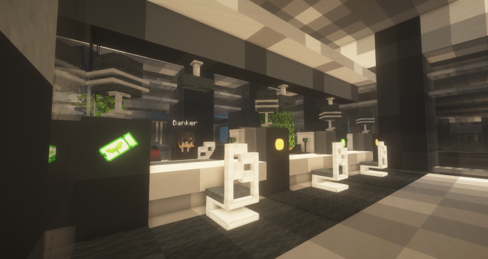

# 🎟️ 스폰구역

<스폰>

<figure><figcaption></figcaption></figure>

<스폰 중앙 분수대>

<figure><figcaption>
스폰 중앙 분수대
</figcaption></figure>

<스폰 중앙타워>

<figure><figcaption>
코인 교환소
</figcaption></figure>

<figure><figcaption>
뉴작물 상점
</figcaption></figure>

<figure><figcaption>
나무 상점
</figcaption></figure>

<figure><figcaption>
3F - 악기 상점
</figcaption></figure>

<자동차 상점>\
<유저상점>
