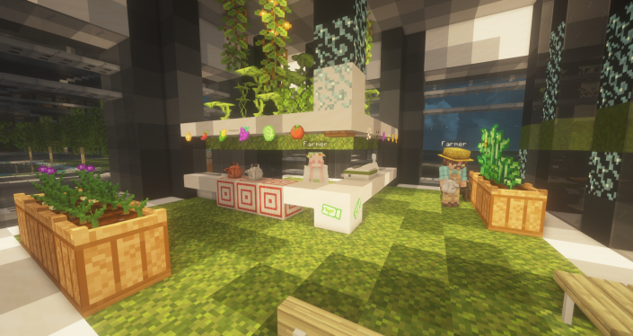
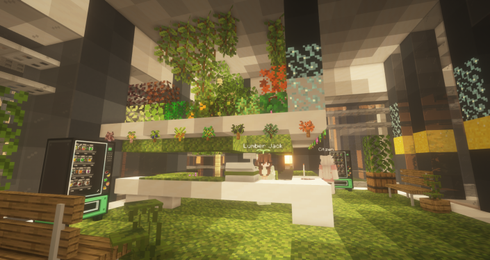

# 🎟️ 신도시 스폰

<신도시 스폰구역>

<figure><figcaption>
신도시 스폰구역
</figcaption></figure>

* 고냥이 타운의 새로운 메인 스폰, 신도시 월드를 만나보세요.
* 신도시 스폰은 현실 컨텐츠를 기반으로 한 다양한 스폰의 역할을 수행합니다. (워프존 및 여러 상점가와 시설, 체험형 건축물 등이 있습니다)&#x20;
* 유저상점에 입주하여 사람들에게 가까운 위치에서 물건을 판매하거나 매입할 수 있습니다.
* 건물 또는 회사를 세워 입주할 수 있습니다.&#x20;

<신도시 상점 타워>

신도시 상점 타워는 서버 메인 상점을 담당하고 있습니다. \
현재는 1\~3층까지 있으며 각각의 상점 역할이 다릅니다

<1층:  코인 상점, 2층: 페인트 상점, 3층: 악기 상점>

1. 은행 환전소&#x20;

<figure><figcaption>
은행 환전소
</figcaption></figure>

* 은행 환전소에서는 작물코인, 고양이 코인 및 기존코인을 환전할 수 있는 환전소가 갖추어져 있습니다.

2\. 뉴작물 상점

<figure><figcaption>
뉴작물 상점
</figcaption></figure>

고

<figure><figcaption>
나무 상점
</figcaption></figure>

<figure><figcaption>
3F - 악기 상점
</figcaption></figure>

<스폰 중앙 분수대 - 낚시상점>

<figure><figcaption>
스폰 중앙 분수대
</figcaption></figure>

* 중앙 분수대에서는 낚시 컨텐츠를 위해&#x20;
* 이 외에도, 자동차 상점과 유저상점 등 다양한 컨텐츠가 준비중입니다.
