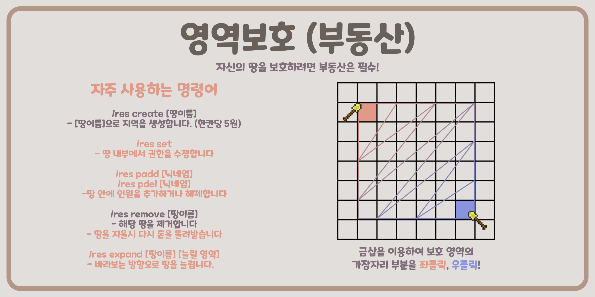
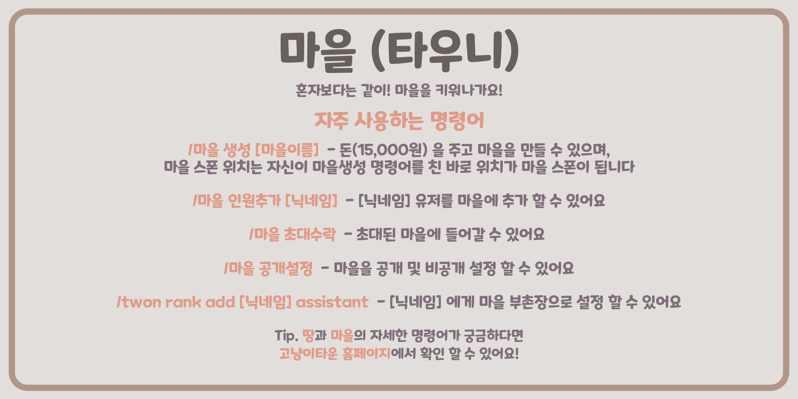
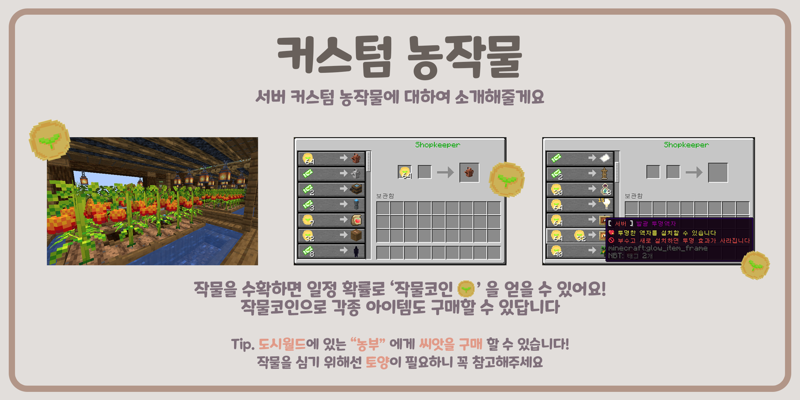

# 🌟 튜토리얼

### ⭐ 서버 특징

* **1.19.3\~4 / 1.20  24시간 반야생 정품 서버**입니다.
* **죽어도 아이템을 잃지 않습니다.**
* **부동산** 명령어를 통해 자신의 땅을 보호할 수 있습니다.
* 자동줍기가 기본으로 적용되어 있으며, (**/자동줍기**)로 킬 수 있습니다.
* **1시간 이상 잠수** 시 **잠수서버로 이동**됩니다. (잠수서버에서는 **잠수 포인트**를 쌓을 수 있습니다.)
* **7분 간격**으로 서버 내에서 떨어진 아이템을 제거하고 있습니다.

### 🚫 방지 아이템

* **TNT, TNT가 실린 카**
* **관측기, 발사기**
* **마인카트, 호퍼카트, 화로카트, 상자카트 등의 모카트**류
* **야생월드에서 흑요석 외 라이터 사용 불가**
* **네더월드를 제외한 다른 월드에서 리스폰 정박기 사용 불가**
* **엔더월드에서 보트 사용 불가**

<figure><figcaption></figcaption></figure>

<figure><figcaption></figcaption></figure>

<figure><figcaption></figcaption></figure>


[command.md](../command.md)


<figure><figcaption></figcaption></figure>

<figure><figcaption></figcaption></figure>


[undefined-1](../../server/undefined-1/)



[mcmmo.md](../../server/mcmmo.md)


<figure><figcaption></figcaption></figure>


[undefined.md](../../contents/undefined.md)


<figure><figcaption></figcaption></figure>


[fishing.md](../../contents/fishing.md)


<figure><figcaption></figcaption></figure>


[cooking](../../contents/cooking/)

