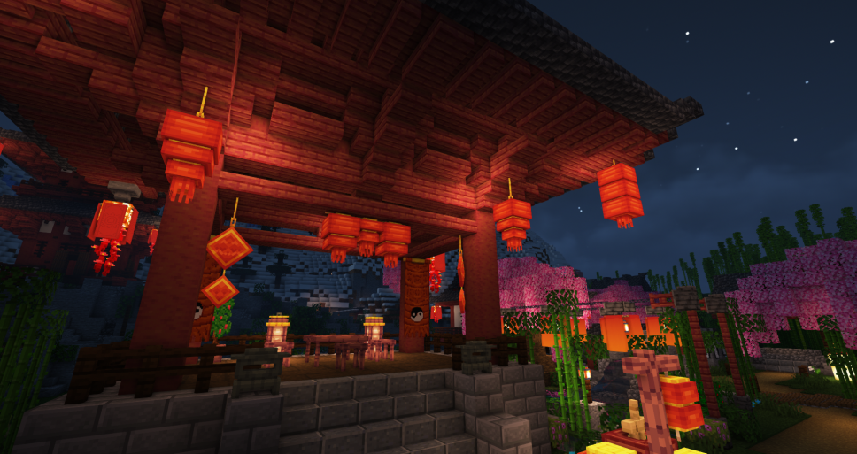
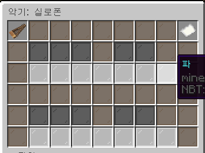
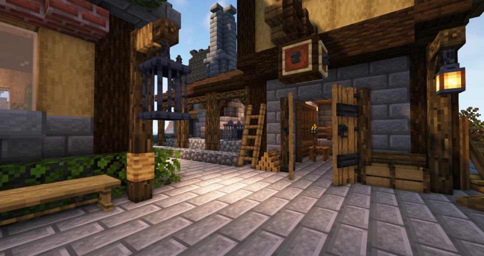
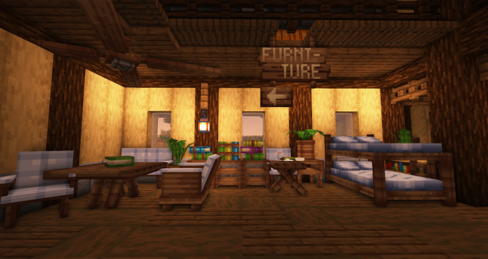
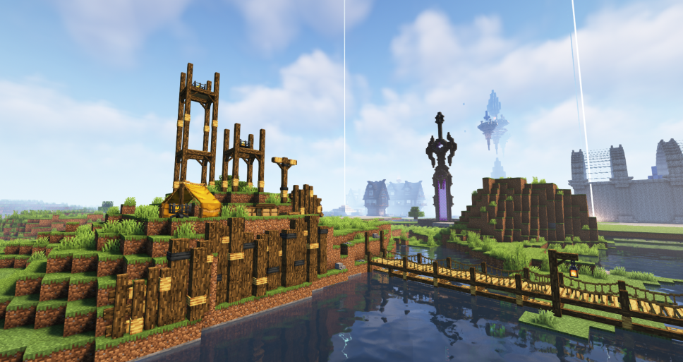
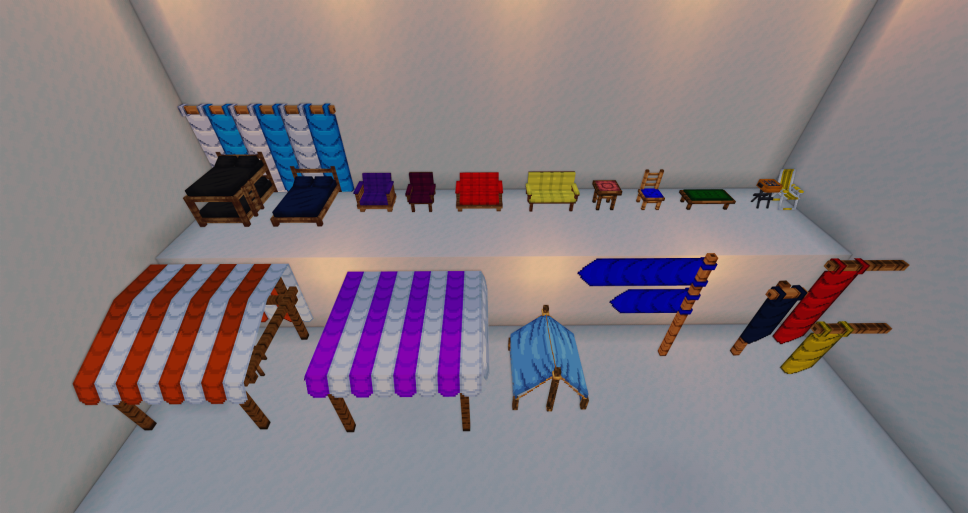
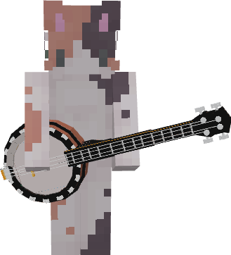
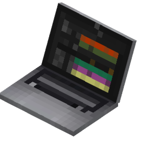
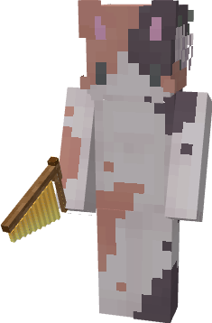

# 🪑\[1.0] 100+ 가구 업데이트

## 🎁  가구 랜덤박스 (중국 춘절 가구 뽑기권) 추가


**랜덤박스는 모두 확률이 동일합니다.**


<figure><figcaption>
춘절 가구 뽑기권으로 뽑을 수 있는 춘절 테마 가구
</figcaption></figure>

중국 춘절 가구를 얻을 수 있는 뽑기권이 추가되었습니다. \
뽑기권을 들고 도시월드 왼쪽 뽑기존에서 등불에 우클릭하면뽑기를 진행할 수 있습니다.

|                                             | 이름           | 획득 경로                | 설명                    |
| ------------------------------------------- | ------------ | -------------------- | --------------------- |
| .png>) | 중국 춘절 가구 뽑기권 | **추천코인, 소지금(/shop)** | 우클릭 시, 확률적으로 춘절 가구 획득 |

가구를 통해 얻을 수 있는 품목과 아이템은 다음과 같습니다.

[랜덤박스 등장 아이템 ] 

.png>)

* 계단형 3단 복자등&#x20;
* 중간 3단 복자등&#x20;
* 끈 달린 복자등&#x20;
* 끈 달린 이중 복자등&#x20;
* 끈 달린 삼중 복자등&#x20;
* 복자 소형 등불&#x20;
* 복자 대형 등불&#x20;
* 복자 대형 가로등&#x20;
* 음양 벽걸이&#x20;
* 복자 소형 가로등&#x20;
* 빨간 우산&#x20;
* **하늘색 우산 (페인트 가능)**&#x20;
* 새해 폭죽 수레&#x20;
* 끈 달린 복자 장식&#x20;
* 벚꽃나무 잎&#x20;
* 단풍나무 잎&#x20;
* 새해 폭죽&#x20;
* 엎어진 새해 폭죽&#x20;
* 벚꽃 의자&#x20;
* 꽃이 핀 벚꽃나무 묘목&#x20;
* 열매가 맺힌 벚꽃나무 묘목&#x20;
* 벚꽃 테이블&#x20;
* 등불 돌 장식

## 🪑  오늘의 가구상점

<figure><figcaption>
도시월드 스폰 앞에 위치한 가구상점
</figcaption></figure>

**139종의 신규 가구**가 등장하는 가구상점이 새롭게 추가되었습니다. 가구는 **매일 오전 8시에** 랜덤으로 **판매 품목이 변경**되며, 일부 **대형 조형물과 페인트 가능한 가구**가 등장합니다. &#x20;

[ 가구상점 등장 아이템 ] 

* **(가격/설명은 추후 위키 정리 예정)**&#x20;

.png>)

.png>)

.png>)

.png>)

### 가구상점 등장 테마

**중세, 나무, 소풍 3개의 테마 가구가 등장합니다.**

<figure><figcaption>
중세 테마 가구
</figcaption></figure>

<figure><figcaption>
중세 테마 가구 2
</figcaption></figure>

<figure><figcaption>
나무 테마 가구
</figcaption></figure>

<figure><figcaption>
소풍 테마 가구
</figcaption></figure>

## 🎨  가구 페인트

<figure><figcaption>
페인트로 색칠한 가구
</figcaption></figure>

<figure><figcaption>
페인트 제작대 사용법
</figcaption></figure>

가구에 색깔을 칠할 수 있는 가구 페인트 시스템이 업데이트 되었습니다.  \
페인트를 하기 위해서는 **페인트 제작대**가 필요하며, 추천코인 3개 또는 **/shop**에서 소지금 5만원에 구매할 수 있습니다. 페인트가 가능한 가구아이템은 설명에 ** **<mark style="color:blue;">**\[🖌️PAINT]**</mark> 가 붙어 있습니다.

|                                       | 이름       | 획득 경로                |                                                                                                 |
| ------------------------------------- | -------- | -------------------- | ----------------------------------------------------------------------------------------------- |
|  |  페인트 제작대 | **추천코인, 소지금(/shop)** | 
우클릭시, 페인트 GUI 오픈  <mark style="color:blue;"><strong>[🖌️PAINT]</strong></mark> 아이템 전용
 |

획득 가능한 페인트 아이템은 다음과 같습니다.&#x20;

* **발렌타인 가구 랜덤박스 - 장미가 든 꽃병**&#x20;
* **중국 춘절 가구 랜덤박스 - 우산**
* **가구상점 - 목재 소파 등 24종**&#x20;

## 🎷옥타브 &합주악기 업데이트

새로운 **옥타브&합주악기**가 상점에 추가되었으며, 추천코인 또는 캐시를 이용하여 구매할 수 있습니다.

<table data-view="cards"><thead><tr><th></th><th></th><th></th></tr></thead><tbody><tr><td></td><td><strong>베이스 기타</strong></td><td></td></tr><tr><td></td><td><strong>벤조</strong></td><td></td></tr><tr><td></td><td></td><td><strong>플링</strong></td></tr><tr><td></td><td></td><td><strong>차임</strong></td></tr><tr><td></td><td><strong>플루트</strong></td><td></td></tr><tr><td></td><td></td><td><strong>디저리두</strong></td></tr></tbody></table>

### &#x20;⚙️업데이트 변경사항

* **뉴작물 상점에 새로운 물뿌리개와 까마귀 아이템이 추가되었습니다.**\
  &#x20; Tip. 까마귀는 장식용 가구아이템이며, 벽 및 바닥에 설치할 수 있습니다.
* 부동산 서브존의 길이 제한이 수정되었습니다.
* 한정 별빛 활의 크기 및 별빛 곡괭이, 괭이의 각도가 소폭 수정되었습니다.
* 낚싯대의 모루/수리하기 시스템이 적용받지 않는 오류가 발견되어 상점 낚싯대를 교체하였습니다.
* 얼음 바이옴 및 기타 바이옴에서 물고기가 등장하지 않은 문제를 수정하였습니다.
* 야생월드에 시범적인 한글/색깔닉이 적용되었습니다. 서버 분할이 완료되면 연동을 시작할 예정입니다.&#x20;
* 서버 핑이 개선되었습니다. (평균 **10\~20ms**)

감사합니다 😺

