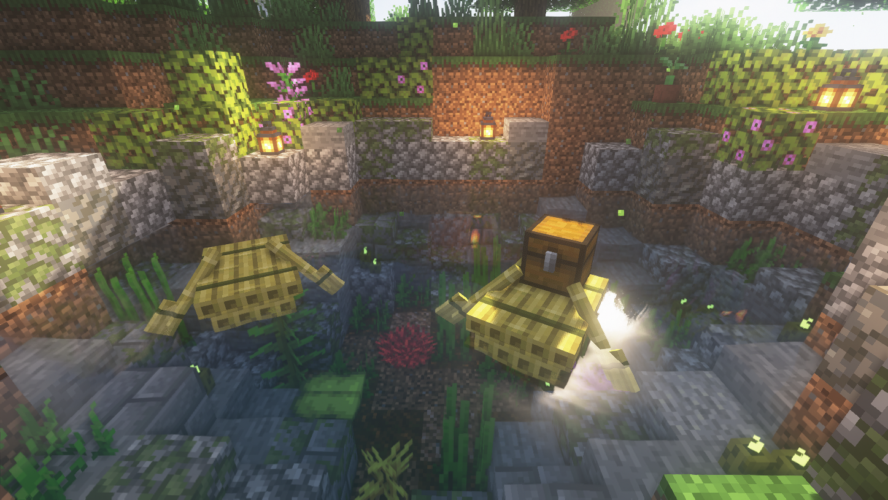

# 🌳 1.20 미리보기 업데이트 (1.19.3 only)


**미리보기 아이템은 1.19.3 / 야생월드 전용 기능입니다.**&#x20;

* **야생 -> 마을월드로 1.19.3 아이템을 이동시킬 수 없습니다.**


야생월드에 **1.19.3 클라이언트**를 사용하여 1.20에 추가될 아이템을 미리 만나볼 수 있습니다.&#x20;

## 1. 낙타

<figure><figcaption></figcaption></figure>

* 낙타는 **사막 주민마을**에서 자연적으로 스폰하며, **안장**을 사용하여 **두명의 플레이어**가 탑승할 수 있습니다.
* **선인장으로 교배**하며, **선인장을 든 플레이어**를 따라다닙니다.&#x20;
* 때때로 앉아 있는 모습을 볼 수 있습니다.

## 2. 뗏목

<figure><figcaption></figcaption></figure>

* 뗏목은 **두 종류**가 있으며, **대나무 판자를 조합**하여 획득할 수 있습니다.
* **보트보다 살짝 높으며, 유사한 특징을 가지고 있습니다.**&#x20;

## 3. 대나무의 사용처 증가 / 다양한  아이템&#x20;

* 이 외에도, 대나무를 포함한 다양한 특색있는 아이템이 추가되었습니다.
* 아래 **아이템 도감**을 참고하여 **새롭게 추가된 아이템**을 만나보세요!

## 4. 아이템 도감

### **4-1. 대나무 관련 아이템**

* 특징: 대나무 관련 아이템 캘 때는 **도끼가 가장 빠릅**니다.
* 대나무 관련 아이템은 **나무 블록 조합법과 유사**합니다.

| 아이콘                                                                     | 이름                | 재료                                                                 | 조합법 / 획득경로                                |
| ----------------------------------------------------------------------- | ----------------- | ------------------------------------------------------------------ | ----------------------------------------- |
|                      | **대나무 블록**        | **대나무 9개**                                                         | .png>) |
|            | **껍질 벗긴 대나무 블록**  | -                                                                  | **대나무 블록을 도끼로 우클릭**                       |
|                         | **대나무 판자**        | 
<strong>대나무 블록</strong>

<strong>껍질 벗긴 대나무 블록</strong>
 | .png>) |
|                    | **대나무 모자이크**      | **대나무 반 블록 2개**                                                    | .png>) |
|                    | **대나무 버튼**        | **대나무 판자**                                                         | .png>) |
|          | **대나무 문**         | **대나무 판자 6개**                                                      | .png>) |
|                     | **대나무 울타리**       | 
<strong>대나무 판자 4개</strong> <strong>막대기 2개</strong>
       | .png>) |
|                    | **대나무 울타리 문**     | 
<strong>대나무 판자 2개</strong> <strong>막대기 4개</strong>
       | .png>)  |
|           | **대나무 압력판**       | **대나무 판자 2개**                                                      | .png>)  |
|          | **대나무 표지판**       | 
<strong>대나무 판자 6개</strong> <strong>막대기</strong>
          | .png>)  |
|                      | **대나무 반 블록**      | **대나무 판자 3개**                                                      | .png>)  |
|              | **대나무 모자이크 반 블록** | **대나무 모자이크 3개**                                                    | .png>)  |
|                    | **대나무 계단**        | **대나무 판자 6개**                                                      | .png>)  |
|            | **대나무 모자이크 계단**   | **대나무 모자이크 6개**                                                    | .png>)  |
|                  | **대나무 다락문**       | **대나무 판자 6개**                                                      | .png>)  |
|               | **대나무 뗏목**        | **대나무 판자 5개**                                                      | .png>)  |
|  | **상자가 실린 대나무 뗏목** | **대나무 뗏목, 상자**                                                     | .png>)  |

### **4-2. 매다는 표지판**

* **사슬을 이용하여** **표지판을** **공중에 매달거나, 블록 등의 벽에 매달 수** 있습니다.
* 표지판처럼 **발광먹물 사용이 가능**합니다.

| 아이콘                                                                         | 이름                 | 재료                                                                | 조합법 / 획득경로                               |
| --------------------------------------------------------------------------- | ------------------ | ----------------------------------------------------------------- | ---------------------------------------- |
|        | **참나무 매다는 표지판**    | 
<strong>껍질 벗긴 참나무 6개</strong> <strong>사슬 2개</strong>
    | .png>) |
|     | **가문비나무 매다는 표지판**  | 
<strong>껍질 벗긴 가문비나무 6개</strong> <strong>사슬 2개</strong>
  | .png>) |
|      | **자작나무 매다는 표지판**   | 
<strong>껍질 벗긴 자작나무 6개</strong> <strong>사슬 2개</strong>
   | .png>) |
|     | **정글나무 매다는 표지판**   | 
<strong>껍질 벗긴 정글나무 6개</strong> <strong>사슬 2개</strong>
   | .png>) |
|     | **아카시아나무 매다는 표지판** | 
<strong>껍질 벗긴 아카시아나무 6개</strong> <strong>사슬 2개</strong>
 | .png>)  |
|  | **짙은 참나무 매다는 표지판** | 
<strong>껍질 벗긴 짙은 참나무 6개</strong> <strong>사슬 2개</strong>
 | .png>)  |
|   | **맹그로브나무 매다는 표지판** | 
<strong>껍질 벗긴 맹그로브나무 6개</strong> <strong>사슬 2개</strong>
 | .png>) |
|     | **대나무 매다는 표지판**    | 
<strong>껍질 벗긴 대나무 블록 6개</strong> <strong>사슬 2개</strong>
 | .png>) |
|    | **진홍빛 매다는 표지판**    | 
<strong>껍질 벗긴 진홍빛 자루 6개</strong> <strong>사슬 2개</strong>
 | .png>) |
|     | **뒤틀린 매다는 표지판**    | 
<strong>껍질 벗긴 뒤틀린 자루 6개</strong> <strong>사슬 2개</strong>
 | .png>) |

### &#x20;**4-3. 기타**

* 조각된 책장은 **최대 6개의 책 또는 인첸트된 책**을 보관할 수 있습니다.
* 피글린 머리는 **레드스톤 또는 머리에 착용할 시**, 귀를 펄럭입니다.

| 아이콘                                                               | 이름         | 재료                                                                                       | 조합법 / 획득경로                               |
| ----------------------------------------------------------------- | ---------- | ---------------------------------------------------------------------------------------- | ---------------------------------------- |
|  | **조각된 책장** | 
<strong>아무</strong> <strong>목재 판자 6개</strong>

<strong>아무 목재 반블록 3개</strong>
 | .png>) |
|            | **피글린 머리** | -                                                                                        | **충전된 크리퍼**를 통해 획득                       |
